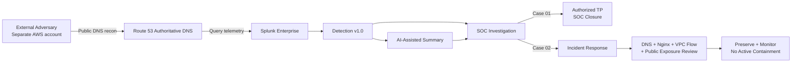
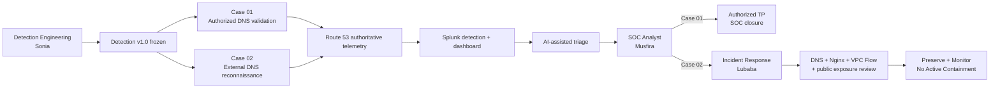

<a id="top"></a>


<div align="center">


<br/>


**A completed, evidence-backed SOC case study covering realistic external DNS reconnaissance, Detection Engineering, AI-assisted investigation, human SOC analysis and independent Incident Response.**

[🏗️ Infrastructure](https://github.com/DNSentinel-Lab/DNS-Lab-Infrastructure) · [**🔎 Scenario 01**](https://github.com/DNSentinel-Lab/Scenario-01-DNS-Recon) · [🧬 Scenario 02](https://github.com/DNSentinel-Lab/Scenario-02-DGA) · [🔄 Scenario 03](https://github.com/DNSentinel-Lab/Scenario-03-Fast-Flux) · [🛰️ Scenario 04](https://github.com/DNSentinel-Lab/Scenario-04-DNS-Tunneling)

</div>


## 🎯 Mission Brief

| Field | Scenario record |
|---|---|
| **Mission** | Detect and investigate public-authoritative DNS reconnaissance without assuming that every unusual DNS pattern is malicious |
| **Status** | ✅ Completed end-to-end SOC exercise |
| **MITRE ATT&CK** | `T1590.002 — Gather Victim Network Information: DNS` |
| **Cyber Kill Chain** | Reconnaissance |
| **Target namespace** | `soclab.abdul4rehman215.tech` |
| **Telemetry** | Route 53 authoritative DNS, Splunk, AWS context, Nginx, VPC Flow, AI result |
| **Operational result** | Case 01 closed by SOC; Case 02 escalated and independently validated by IR |

### What this scenario proves

A correct alert is not the same thing as a confirmed malicious incident. This scenario demonstrates the full decision chain from behavior-based DNS detection through source attribution, AI validation, SOC disposition, independent IR review and proportionate response.


## 🏗️ Scenario Architecture



> The scenario uses the shared DNSentinel infrastructure but keeps the project view focused on the actual attack → detection → investigation → response path.


## 🔄 SOC Lifecycle & Implementation Reality

| Stage | State |
|---|---|
| **Simulate** | ✅ |
| **Observe** | ✅ |
| **Detect** | ✅ |
| **AI Assist** | ✅ |
| **SOC Investigate** | ✅ |
| **IR Decide** | ✅ |
| **Verify** | ✅ |
| **Document** | ✅ |

> [!IMPORTANT]
> ✅ means supported by implemented project evidence. 🟡 means design/infrastructure/documentation exists but the scenario stage is not complete. ⚪ means planned and is **not presented as implemented**.


## 🖼️ Evidence Highlights

<table>
<tr>
<td width="50%"><br/><sub><b>Case 01:</b> real alert, authorized activity.</sub></td>
</tr>
<tr>
<td width="50%"><br/><sub><b>Case 02:</b> staged DNS reconnaissance timeline.</sub></td>
<td width="50%"><br/><sub><b>IR:</b> network correlation without over-attribution.</sub></td>
</tr>
</table>

Full role- and case-organized evidence is available in [`screenshots/`](screenshots/) and [`evidence/`](evidence/).


## 📋 Scenario at a Glance

Scenario 01 tests whether public-authoritative DNS reconnaissance can be detected and investigated without assuming that every unusual DNS pattern is malicious.

**Primary MITRE ATT&CK:** `T1590.002 — Gather Victim Network Information: DNS`  
**Cyber Kill Chain:** Reconnaissance  
**Target namespace:** `soclab.abdul4rehman215.tech`

| Role | Owner | What was completed |
|---|---|---|
| **Project Lead / Adversary** | [Abdul-Rehman](https://github.com/abdul4rehman215) | Preserved exercise separation, generated the authorized Case 01 activity, and executed external DNS reconnaissance from a separate AWS account |
| **SOC Analyst / Threat Hunter** | [Musfira](https://github.com/MUSFIRA-ZAFAR) | Investigated both cases from Splunk evidence, validated AI output, closed Case 01, and escalated Case 02 |
| **Detection Engineer** | [Sonia](https://github.com/sonia11mansha415) | Built the baseline, dashboard, hunting SPL, detection v1.0, scheduled alert and Scenario 01 AI evidence path |
| **Incident Responder / Defender** | [Lubaba](https://github.com/lubaba1513-pixel) | Independently validated Case 02, scoped DNS/Web/VPC evidence, reviewed public exposure and selected the final response |

## 🧾 Final Outcomes

| Case | Detection result | Human conclusion | Final action |
|---|---|---|---|
| **Case 01** | `16 queries / 4 names / 4 types` | **Authorized / Benign True Positive** | Closed by SOC; no IR escalation |
| **Case 02** | `53 queries / 17 names / 6 types` | **True Positive — Suspicious / Likely Unauthorized DNS Reconnaissance** | Escalated to IR; **Preserve + Monitor — No Active Containment** |

> [!IMPORTANT]
> `observed_dns_source` is the resolver/source address seen by Route 53 authoritative logging. It is not automatically the original endpoint that initiated the DNS lookup. That distinction influenced both SOC attribution and the IR containment decision.

---

## 🔄 How the Exercise Unfolded



The exercise was deliberately **information-separated**. Attacker timing, commands and ground truth were not used to guide the SOC or IR conclusions. Defender decisions were based on Route 53, Splunk, AWS asset context, Nginx, VPC Flow and the scenario AI result.

---

## 🛠️ Detection Engineering Foundation

Before the operational exercise began, Sonia built and validated the analyst-facing detection path:

```text
Route 53 telemetry
  → field semantics
  → ingestion timing
  → baseline
  → investigation dashboard
  → hunting SPL
  → detection v1.0
  → positive + benign validation
  → scheduled alert
  → AI evidence contract
```

Final behavioral boundary:

```text
query_count >= 16
unique_names >= 4
distinct_query_types >= 3
```

`NXDOMAIN` remains useful evidence context; it is not a mandatory detection condition.


*The final Splunk Dashboard Studio view connects high-level DNS behavior with source-aware pivots and raw events.*

Read the full engineering story in [`detection-engineering/DETECTION-ENGINEERING.md`](detection-engineering/DETECTION-ENGINEERING.md).

---

## 🟢 Case 01 — The Alert Was Real, but the Activity Was Authorized

Case 01 came from the defender-owned `dns-soc-web01` asset. A post-change DNS validation sequence generated a concentrated authoritative-DNS pattern that genuinely crossed Detection v1.0.


*The operational validation checked four names across A, AAAA, TXT and CNAME directly against the authoritative path.*

SOC then proved the activity belonged to a known lab asset and obtained authorization context. The correct conclusion was therefore **Authorized / Benign True Positive**, not “false positive.”


*The detection correctly identified reconnaissance-like behavior; business and asset context changed the disposition.*

Deep case record: [`soc/case-01-soc-investigation-closure.md`](soc/case-01-soc-investigation-closure.md)

---

## 🟠 Case 02 — External DNS Reconnaissance

The external adversary operated from a separate AWS account and used public DNS only. The activity progressed from authority/zone inspection into service-name and record-type enumeration.


*The adversary probed meaningful service/environment labels against the public authoritative namespace rather than relying on attacker-side access to the defender account.*

The defender-side result was a clear reconnaissance outlier:

```text
53 DNS queries
17 unique queried names
6 query types: A, AAAA, MX, NS, SOA, TXT
44 NXDOMAIN / 9 NOERROR
~43-second observed interval
```


*Musfira reconstructed the staged DNS bursts from Route 53 telemetry before making the final disposition.*

SOC closed its investigation as **True Positive — Suspicious / Likely Unauthorized DNS Reconnaissance**, High confidence, Medium risk, and transferred an evidence-backed handoff to Incident Response.

Deep case record: [`soc/case-02-soc-investigation-ir-handoff.md`](soc/case-02-soc-investigation-ir-handoff.md)

---

## 🛡️ Incident Response — Confirm the Behavior, Do Not Over-Attribute It

Lubaba did not simply accept the SOC conclusion. IR independently reproduced the core counts, validated the seven-day baseline, expanded the DNS timeline, correlated Nginx and VPC Flow evidence, compared peer DNS sources, and reviewed the Route 53 public hosted-zone records.


*VPC Flow telemetry corroborated a web connection seen by Nginx, but the web client could not be proven to be the same original endpoint behind the Route 53-observed DNS source.*

The case remained scoped to **Reconnaissance**. No exploitation, persistence, C2 or impact was established.

Final IR decision:

> **PRESERVE + MONITOR ONLY — NO ACTIVE CONTAINMENT**

The decision was intentional: the Route 53 source was resolver-side evidence, no malicious web progression was proven, and the public DNS records were required or benign. Blocking an unproven endpoint would have created attribution and availability risk without an evidence-backed security benefit.

Read [`ir/INCIDENT-RESPONSE.md`](ir/INCIDENT-RESPONSE.md) and [`ir/case-02-validation.md`](ir/case-02-validation.md).

---

## 🤖 AI Was Assistance, Not Authority

The Scenario 01 AI path returned a structured result into `index=dns_soc_ai`, including summary, confidence, observed indicators, MITRE suggestions, missing evidence and response considerations.

Both Musfira and Lubaba treated AI output as a lead to validate, not a verdict to accept.

```text
AI statement
    ↓
What raw evidence proves this?
    ↓
Supported / incomplete / unsupported
    ↓
Human decision
```

That pattern matters most in Case 02: the AI correctly suggested DNS reconnaissance and `T1590.002`, but source identity, authorization and follow-on activity remained human investigation questions.

---

## 🌐 Network and Protocol View

| Layer / view | Scenario 01 evidence |
|---|---|
| **Layer 7 — DNS** | query name, query type, response code, authoritative behavior, NXDOMAIN pattern |
| **Layer 4** | UDP DNS; later TCP 80/443 seen in supporting web/network evidence |
| **Layer 3** | Route 53-observed resolver/source values and VPC Flow source/destination correlation |
| **Application** | Nginx method, URI, HTTP status, user agent |
| **Cloud** | Route 53 hosted-zone records, CloudTrail/SSM asset attribution for Case 01 |
| **SIEM / AI** | Splunk alert, dashboard, raw events, AI enrichment and analyst validation |

---

## 🗂️ Repository Navigation

| Area | Purpose |
|---|---|
| [`SCENARIO-01-EXECUTION.md`](SCENARIO-01-EXECUTION.md) | Concise end-to-end scenario story |
| [`detection-engineering/`](detection-engineering/) | Sonia's engineering lifecycle and validation record |
| [`attacker/`](attacker/) | Project Lead / Adversary story and reproducible adversary playbook |
| [`soc/`](soc/) | Musfira's investigation story, reusable playbook and case dossiers |
| [`ir/`](ir/) | Lubaba's IR investigation, validation matrix and final response decision |
| [`exercise/`](exercise/) | Information-separation protocol and final perspective comparison |
| [`dashboard/`](dashboard/) | Splunk Dashboard Studio JSON and dashboard notes |
| [`spl/`](spl/) | Baseline, hunting, detection, validation SPL and scheduled-alert configuration |
| [`ai/`](ai/) | Scenario-specific AI evidence mapping |
| [`evidence/`](evidence/) | Master evidence map |
| [`screenshots/`](screenshots/) | Curated visual evidence by role and case |

---

## ✅ Scenario Completion Record

| Gate | Status |
|---|---|
| Detection Engineering | ✅ Complete |
| Dashboard / hunting / detection SPL | ✅ Complete |
| Scheduled alert | ✅ Validated |
| AI evidence path | ✅ Validated |
| Realistic adversary execution | ✅ Complete |
| Case 01 SOC investigation | ✅ Closed — Authorized TP |
| Case 02 SOC investigation | ✅ Escalated — Suspicious TP |
| Incident Response validation | ✅ Complete |
| Containment decision | ✅ Preserve + Monitor — No Active Containment |
| Final comparison / lessons | ✅ Complete |

> [!NOTE]
> Scenario 01 demonstrates that a mature security decision is not always “block something.” Detection, attribution, business context and response proportionality all mattered to the final outcome.


## 🧠 Security Engineering Skills Demonstrated

| Skill area | Scenario evidence / design focus |
|---|---|
| **DNS Analysis** | Authoritative query names/types, response patterns, NXDOMAIN and resolver/source semantics |
| **Detection Engineering** | Baseline, hunting SPL, detection v1.0, validation, scheduled alert and dashboard |
| **SOC Investigation** | Source attribution, 5W1H, timeline, peer comparison and disposition |
| **Incident Response** | Independent validation, cross-telemetry scope and proportional response |
| **Network Correlation** | Nginx + VPC Flow + AWS asset context |
| **AI-Assisted SOC** | Structured AI output checked against raw evidence |


## 📚 Documentation Model

This scenario repository is a **case/execution layer** built on the shared [DNS Lab Infrastructure](https://github.com/DNSentinel-Lab/DNS-Lab-Infrastructure). It intentionally separates:

- **Design / prerequisites** — what must exist before the exercise;
- **Simulation / ground truth** — what the authorized operator actually generated;
- **Detection Engineering** — baseline, hunting, tuned detection and validation;
- **SOC investigation** — defender-visible evidence and human disposition;
- **IR / containment** — independently justified response and verification;
- **Evidence** — screenshots and structured artifacts that prove the final claims.

> [!NOTE]
> Planned work stays labelled as planned. This repository does not create fake screenshots, fake SPL results, fake ML metrics or fake incident outcomes to make a scenario look complete.

<div align="center">

### DNSentinel Lab
**Build the telemetry. Prove the detection. Investigate the evidence. Verify the response.**

[🏗️ Infrastructure](https://github.com/DNSentinel-Lab/DNS-Lab-Infrastructure) · [**🔎 Scenario 01**](https://github.com/DNSentinel-Lab/Scenario-01-DNS-Recon) · [🧬 Scenario 02](https://github.com/DNSentinel-Lab/Scenario-02-DGA) · [🔄 Scenario 03](https://github.com/DNSentinel-Lab/Scenario-03-Fast-Flux) · [🛰️ Scenario 04](https://github.com/DNSentinel-Lab/Scenario-04-DNS-Tunneling)

[⬆ Back to top](#top)

</div>


