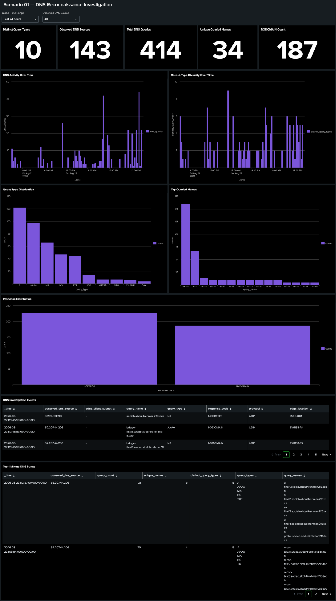
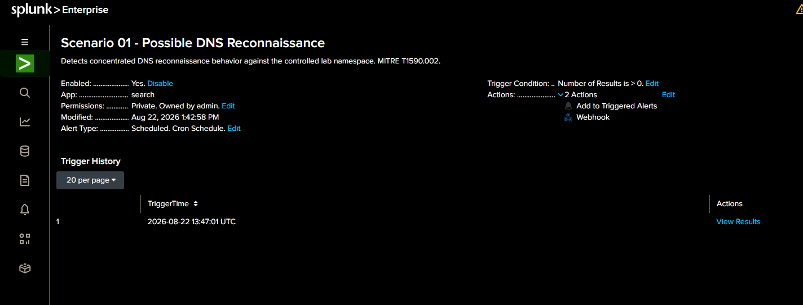

<div align="center">


**A controlled SOC-lab Detection Engineering project that turns real Route 53 authoritative DNS telemetry into an analyst-ready Splunk detection, scheduled alert, investigation dashboard and AI-assisted triage path.**

[Detection Engineering Story](DETECTION-ENGINEERING.md) · [Runbook](SCENARIO-RUNBOOK.md) · [SPL](spl/README.md) · [Dashboard](dashboard/README.md) · [Evidence](evidence/README.md) · [AI Mapping](ai/README.md)

</div>


## 🎯 Scenario objective

Scenario 01 tests whether concentrated DNS enumeration against the controlled `soclab.abdul4rehman215.tech` namespace can be separated from ordinary public DNS activity using real Route 53 authoritative telemetry.

The engineering goal was not simply to make an SPL search return a row. The goal was to build a defensible chain:

```text
trusted DNS telemetry
    → field semantics
    → ingestion timing
    → baseline
    → investigation dashboard
    → hunting
    → behavioral detection
    → positive + benign validation
    → scheduled alert
    → analyst-ready evidence
    → AI-assisted triage
```

**Primary MITRE ATT&CK:** `T1590.002 — Gather Victim Network Information: DNS`

> [!IMPORTANT]
> **Detection Engineering for Scenario 01 is complete. The full Scenario 01 SOC/IR exercise is not yet complete.** Official simulation ground truth, SOC Analyst final disposition, Incident Response, containment and post-response verification remain separate later phases.

## 👩‍💻 Detection Engineer — Sonia

**[Sonia](https://github.com/sonia11mansha415)** owned the Scenario 01 Detection Engineering lifecycle.

This was her first end-to-end Detection Engineering assignment. She worked from raw telemetry, mapped the real DNS fields, measured ingestion behavior, established a baseline, engineered the investigation dashboard, built hunting and detection SPL, validated positive and benign traffic, operationalized the rule as a scheduled alert, debugged cross-layer telemetry and alert-action failures, and completed and validated the Scenario 01 AI evidence path back into Splunk.

Her work is documented in detail in [`DETECTION-ENGINEERING.md`](DETECTION-ENGINEERING.md).

### Engineering responsibilities completed

| Area | Practical work demonstrated |
|---|---|
| **Telemetry understanding** | Mapped real Route 53 authoritative records and preserved neutral source semantics |
| **Baseline engineering** | Measured normal query volume, unique-name breadth and query-type diversity before threshold selection |
| **Dashboard engineering** | Built the interactive Scenario 01 Splunk Dashboard Studio investigation surface |
| **Threat hunting** | Built source/window behavior and raw-event investigation pivots |
| **Detection engineering** | Developed and finalized behavioral detection `v1.0` from observed evidence |
| **Validation** | Proved controlled positive behavior triggers and benign/basic DNS activity remains below threshold |
| **Alert engineering** | Created, tuned and validated the scheduled Splunk alert and analyst evidence row |
| **Troubleshooting** | Isolated Kinesis/KV Store, Linux kernel, scheduler, webhook and schema failures |
| **AI integration** | Mapped stable alert fields into the shared AI bridge and validated the result in `dns_soc_ai` |

## 🧠 Final detection at a glance

The final rule is intentionally behavioral:

```text
same observed DNS source
+ controlled lab namespace
+ concentrated 1-minute activity
+ query-name breadth
+ meaningful record-type diversity
→ Possible DNS Reconnaissance
```

Final threshold:

```text
query_count >= 16
unique_names >= 4
distinct_query_types >= 3
```

`NXDOMAIN` is retained as useful context, **not** as a mandatory detection condition.

Why these values exist:

- measured baseline maximum query count: **15**;
- measured baseline maximum unique names: **3**;
- baseline showed record-type diversity can be high even in background traffic;
- the controlled positive test produced **20 queries / 4 names / 5 record types**.

The production SPL is preserved in [`spl/detection.spl`](spl/detection.spl).

## 📊 Investigation dashboard

The final Splunk Dashboard Studio implementation gives the analyst a fast path from summary to underlying DNS evidence.



*The final dashboard combines source-aware KPIs, DNS activity and diversity over time, query/response distributions, top names, raw investigation events and 1-minute burst analysis under a shared time range.*

The tested Dashboard Studio definition is committed as [`dashboard/scenario-01-dns-recon.dashboard.json`](dashboard/scenario-01-dns-recon.dashboard.json).

## ✅ Engineering validation summary

| Validation | Result |
|---|---|
| Real Route 53 fields understood | ✅ PASS |
| Source identity semantics kept neutral | ✅ PASS |
| Ingestion delay measured before alert scheduling | ✅ PASS |
| Baseline captured before threshold choice | ✅ PASS |
| Investigation dashboard validated | ✅ PASS |
| Hunting searches validated | ✅ PASS |
| Controlled recon-like positive test | ✅ PASS |
| Benign/basic DNS test | ✅ PASS — no detection |
| Final detection `v1.0` | ✅ PASS |
| `validation.spl` positive + below-threshold view | ✅ PASS |
| Scheduled alert | ✅ PASS |
| Raw-event drilldown | ✅ PASS |
| MITRE `T1590.002` | ✅ PASS |
| AI webhook contract | ✅ PASS |
| OpenAI processing | ✅ HTTP 200 |
| AI result indexed in `dns_soc_ai` | ✅ PASS |

See [`evidence/detection-engineering-validation.md`](evidence/detection-engineering-validation.md) for the evidence-backed validation record.

## 🚨 Scheduled alert

**Alert:** `Scenario 01 - Possible DNS Reconnaissance`

```text
Schedule:        * * * * *
Search lookback: Last 3 minutes
Trigger:         Number of Results > 0
Trigger mode:    Once
Throttle:        60 seconds
Severity:        Medium
Actions:         Add to Triggered Alerts + Webhook
```



*The scheduled alert is enabled, fires automatically and forwards the structured result to the shared AI bridge.*

Full configuration notes are in [`spl/scheduled-alert.md`](spl/scheduled-alert.md).

## 🤖 Scenario 01 AI evidence path

The detection remains independent of the LLM. After the alert fields were stable, Sonia mapped them into the already-deployed shared AI bridge:

```text
Detection v1.0
    → scheduled alert
    → native Splunk webhook
    → Scenario 01 evidence contract
    → shared AI bridge
    → OpenAI structured response
    → internal HTTPS HEC
    → index=dns_soc_ai
    → human analyst validation
```

The final indexed event keeps `human_validation_required=true`. AI is analyst assistance, not an automatic verdict or response authorization.

See [`ai/scenario-01-ai-mapping.md`](ai/scenario-01-ai-mapping.md).

## 🔬 Real telemetry used

Primary Scenario 01 source:

```text
index=dns_soc_aws
sourcetype=aws:kinesis
```

Mapped Route 53 fields:

```text
query_name
query_type
response_code
protocol
edge_location
observed_dns_source
edns_client_subnet
```

`observed_dns_source` means the source/resolver address seen by Route 53. It is deliberately **not** renamed `attacker_ip` without stronger attribution evidence.

Supporting telemetry exists in the shared lab, but this Detection Engineering phase did not force unrelated Nginx, Resolver or CloudTrail data into the rule when they did not improve the detection hypothesis.

## 🧩 Engineering challenges that mattered

Three troubleshooting cases materially improved the implementation:

1. **Fresh Route 53 telemetry stopped arriving.** Sonia traced the failure past the detection into the AWS Kinesis collector, found KV Store checkpoint errors, and helped isolate a Splunk KV Store/MongoDB startup problem on the newer kernel.
2. **The scheduled alert fired but AI processing failed.** The webhook path was healthy; the bridge rejected the payload because the alert result did not match the required schema. Sonia then further corrected the [**detection spl**](https://github.com/DNSentinel-Lab/Scenario-01-DNS-Recon/blob/main/spl/detection.spl).

3. **AI output reached Splunk but initially looked empty in a table.** The event was nested JSON. Sonia extracted the correct `alert.*` and `ai.*` paths and produced a clean analyst view.

The full technical story and lessons learned are in [`DETECTION-ENGINEERING.md`](DETECTION-ENGINEERING.md).

## 🗂️ Repository map

```text
.
├── README.md
├── DETECTION-ENGINEERING.md
├── SCENARIO-RUNBOOK.md
├── dashboard/
│   ├── README.md
│   └── scenario-01-dns-recon.dashboard.json
├── spl/
│   ├── README.md
│   ├── baseline.spl
│   ├── hunting.spl
│   ├── detection.spl
│   ├── validation.spl
│   └── scheduled-alert.md
├── ai/
│   ├── README.md
│   └── scenario-01-ai-mapping.md
├── evidence/
│   ├── README.md
│   └── detection-engineering-validation.md
├── screenshots/
│   ├── README.md
│   ├── detection-engineering/
│   └── troubleshooting/
└── ir/
    └── README.md
```

## 👥 Scenario team

| Role | Member | Current Scenario 01 status |
|---|---|---|
| Project Lead / Controlled Simulation | [Abdul-Rehman](https://github.com/abdul4rehman215) | Detection Engineering test traffic supported; official exercise pending |
| SOC Analyst | [Musfira](https://github.com/MUSFIRA-ZAFAR) | Official Scenario 01 investigation pending |
| **Detection Engineer** | **[Sonia](https://github.com/sonia11mansha415)** | **✅ Detection Engineering complete** |
| IR / Defender | [Lubaba](https://github.com/lubaba1513-pixel) | Official response/verification pending |

## 📌 What remains outside this completed phase

Detection Engineering readiness does **not** mean the whole Scenario 01 exercise is closed.

Still pending for the official exercise:

```text
official ground truth
→ SOC Analyst investigation
→ AI vs human comparison in the exercise context
→ IR decision
→ containment if approved
→ post-response verification
→ final scenario outcome
```

That boundary keeps the repository truthful and follows the shared project documentation standard.

## 🔗 Shared project references

- [DNS Lab Infrastructure](https://github.com/DNSentinel-Lab/DNS-Lab-Infrastructure)
- [Scenario documentation standard](https://github.com/DNSentinel-Lab/DNS-Lab-Infrastructure/blob/main/00-project-design/scenario-documentation-standard.md)
- [Scenario infrastructure roadmap](https://github.com/DNSentinel-Lab/DNS-Lab-Infrastructure/blob/main/00-project-design/scenario-infrastructure-roadmap.md)

> [!NOTE]
> This repository documents controlled security engineering on infrastructure and domains owned by, or explicitly authorized for, the project team.
