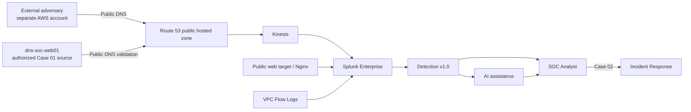
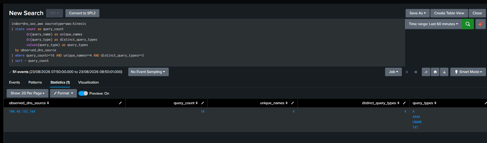
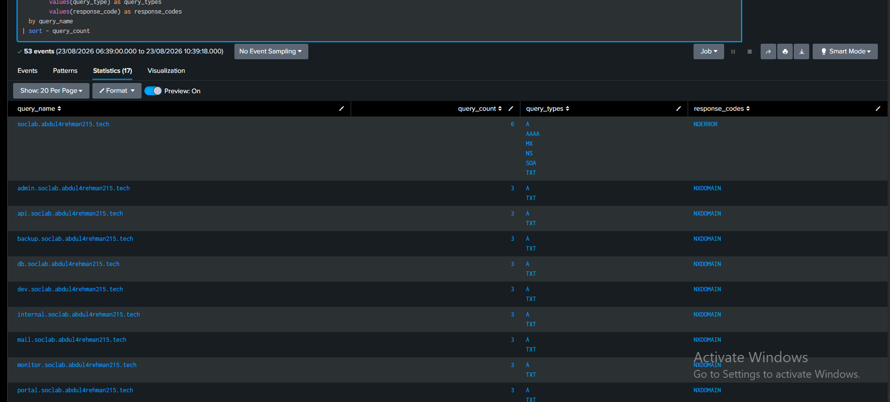
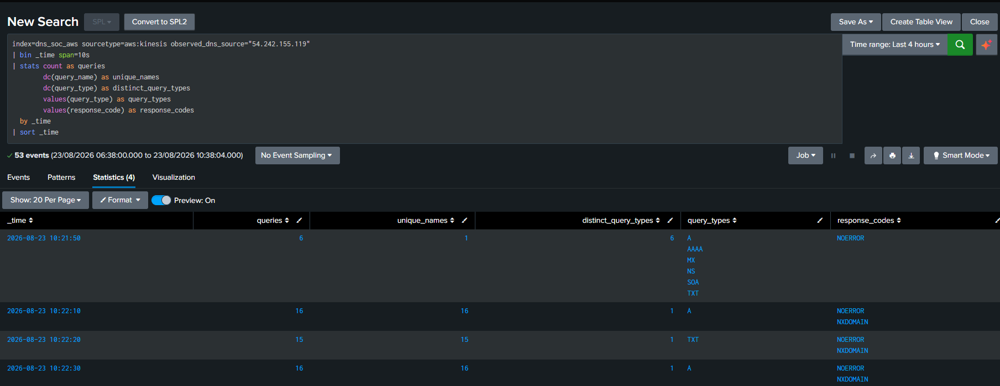
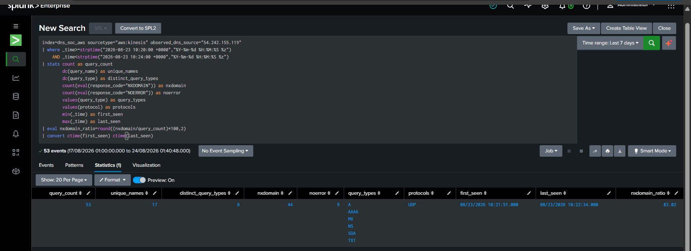
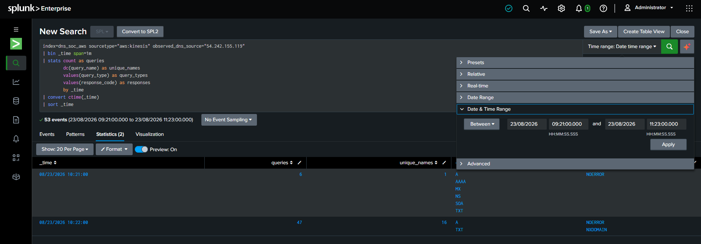
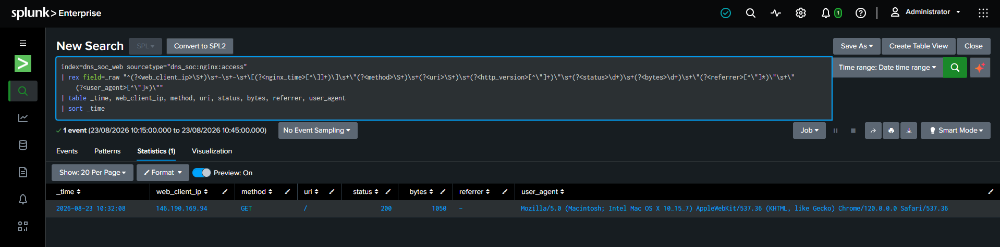
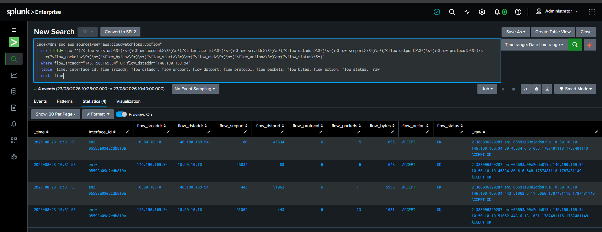
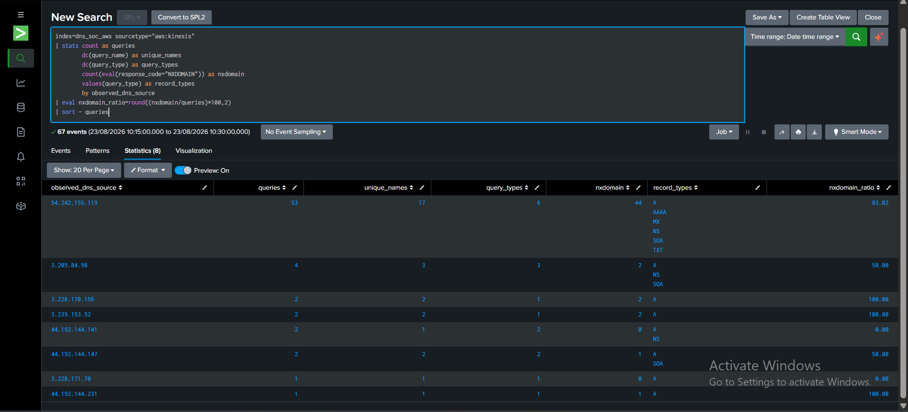
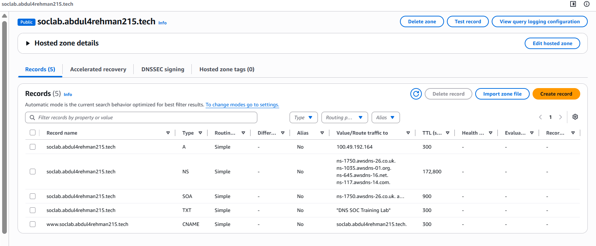

# Scenario 01 Execution — DNS Reconnaissance from Adversary to Defender

**Status:** ✅ Complete  
**Scenario:** DNS Reconnaissance & Enumeration  
**MITRE ATT&CK:** `T1590.002 — Gather Victim Network Information: DNS`  
**Cyber Kill Chain:** Reconnaissance

This document is the short operational story of Scenario 01. It connects the four role perspectives without replacing their deeper technical records.

## 1. Operating model

The exercise used a real public boundary:



The adversary did not receive defender-side visibility. The SOC Analyst did not receive attacker commands, timing or ground truth. IR began from the SOC handoff and independently checked the evidence before deciding on response.

## 2. Roles

| Role | Owner | Core responsibility |
|---|---|---|
| Project Lead / Adversary | Abdul-Rehman | Execute the exercise, preserve ground truth, keep attacker/defender information separated |
| Detection Engineer | Sonia | Build and freeze the analyst-ready detection before live execution |
| SOC Analyst | Musfira | Investigate alerts from raw defender evidence and decide disposition/escalation |
| Incident Responder / Defender | Lubaba | Validate the escalation, scope the incident and choose a proportionate response |

## 3. Detection was frozen before the exercise

Sonia's Detection Engineering phase completed first. The production rule was not tuned in response to the live cases.

```text
query_count >= 16
AND unique_names >= 4
AND distinct_query_types >= 3
```

This mattered because it prevented the exercise from becoming “change the rule until the expected answer appears.”

## 4. Case 01 — authorized activity that looked like reconnaissance

### Ground-truth purpose

`dns-soc-web01` performed a post-change DNS validation against the public lab namespace. The final concentrated authoritative check tested four names across four DNS types.


### What the defender observed

| Field | Observed result |
|---|---|
| Observed source | `100.49.192.164` |
| Time | `2026-08-23 08:41:55` |
| Query count | `16` |
| Unique names | `4` |
| Query types | `A, AAAA, CNAME, TXT` |
| Protocol | UDP |

The production detection triggered correctly.



### How Musfira reached the disposition

Musfira did not stop at the alert. She checked raw DNS events, the exact one-second timeline, the seven-day history, cross-telemetry evidence, CloudTrail/SSM asset attribution, private-IP/resolver context and the AI result. Defender evidence mapped the public source to the known `dns-soc-web01` asset and authorization was confirmed.

**Final SOC disposition:** **Authorized / Benign True Positive**  
**Confidence:** High  
**Escalation:** None

The lesson was precise: **a correct detection can fire on legitimate behavior. Authorization is an investigation fact, not a DNS pattern.**

## 5. Case 02 — external DNS reconnaissance

### Adversary objective

The external Kali host operated outside the defender AWS account and attempted to learn what the public namespace exposed. The sequence included authority/zone discovery, record-type checks, service-name enumeration and a safe zone-transfer check.


The adversary remained within Scenario 01's reconnaissance boundary. Exploitation, credential attacks, destructive actions and denial of service were outside scope.

### What Route 53 and Splunk exposed to the defender

The final Case 02 defender record showed:

```text
Observed DNS source: 54.242.155.119
53 DNS queries
17 unique queried names
6 DNS record types
44 NXDOMAIN / 9 NOERROR
2026-08-23 10:21:51 → 10:22:34
```

The service/environment labels included names such as `admin`, `api`, `backup`, `db`, `dev`, `internal`, `mail`, `monitor`, `portal`, `prod`, `stage`, `staging`, `test` and `vpn`.



> [!IMPORTANT]
> The Route 53-observed source is resolver-side evidence. It is not sufficient by itself to identify the original attacker endpoint.

## 6. Musfira's Case 02 investigation

Musfira reconstructed the behavior from the defender side:

```text
alert
→ raw DNS events
→ staged timing
→ name breadth
→ response pattern
→ 7-day baseline
→ source/ownership checks
→ AI validation
→ 5W1H
→ risk
→ disposition
```



The evidence showed a first-seen, high-breadth DNS outlier with no known defender ownership or approved purpose in the available evidence.

**Final SOC disposition:** **True Positive — Suspicious / Likely Unauthorized DNS Reconnaissance**  
**SOC confidence:** High  
**Risk:** Medium  
**Action:** Escalate to Incident Response

## 7. Lubaba's Incident Response investigation

IR started from Musfira's handoff rather than attacker ground truth.

### 7.1 Reproduce the SOC facts

Lubaba independently reproduced `53 / 17 / 6`, the response distribution and the exact observed interval.



### 7.2 Confirm the history and timeline

The same observed DNS source appeared only in the Case 02 burst within the available seven-day evidence. A custom expanded timeline showed no continued activity from that source before or after the original burst in the scoped window.



### 7.3 Scope the web evidence

Nginx contained one later request:

```text
2026-08-23 10:32:08
client: 146.190.169.94
GET /
HTTP 200
```



The request was real, but there was no repeated path probing, HEAD enumeration, 404 scanning or exploit-like sequence from that web client. The client could not be proven to be the original endpoint behind the Route 53-observed DNS source.

### 7.4 Correlate the network layer

VPC Flow Logs independently showed the same web client communicating with `dns-soc-web01` (`10.50.10.10`) on TCP 80/443.



This corroborated the web connection, **not** attribution to the DNS reconnaissance source.

### 7.5 Compare peer DNS sources

Case 02 was the clear DNS outlier in the same window; peer sources showed only small query volumes and much lower name breadth.



### 7.6 Review what public DNS intentionally exposed

The Route 53 hosted zone contained the expected public records: A, NS, SOA, TXT and `www` CNAME. No credentials, internal host inventory or administrative secrets were exposed by the record set.



## 8. Final response decision

IR confirmed DNS reconnaissance behavior but did not establish progression beyond reconnaissance.

**Final IR action:** **PRESERVE + MONITOR ONLY — NO ACTIVE CONTAINMENT**

Why:

- original client attribution remained unresolved;
- the Route 53-observed source should not be treated as a proven attacker endpoint;
- the single web request was not proven malicious or connected to the DNS source;
- public DNS exposure was limited and intentional;
- an unsupported block could disrupt legitimate DNS use without addressing a proven malicious endpoint.

This was a response decision, not an absence of response.

## 9. AI vs human judgement

AI correctly identified possible DNS reconnaissance and suggested `T1590.002 / Reconnaissance`. It also exposed missing evidence around source identity, authorization, timing and follow-on activity.

Human investigation then resolved or refined those gaps:

| AI question / gap | Human result |
|---|---|
| Timing / burst pattern | Resolved from raw Route 53 timeline |
| Protocol | Resolved as UDP |
| Historical behavior | Resolved from seven-day baseline |
| Source ownership | Resolved in Case 01; unresolved in Case 02 |
| Authorization | Confirmed in Case 01; unresolved in Case 02 |
| Follow-on activity | Scoped by IR using Nginx and VPC Flow |
| Automatic containment | Rejected; human approval and attribution required |

## 10. Final Scenario 01 results

| Perspective | Case 01 | Case 02 |
|---|---|---|
| Behavior | Reconnaissance-like authorized validation | External DNS reconnaissance |
| Detection | Triggered correctly | Triggered correctly |
| AI | Useful but incomplete | Useful but incomplete |
| SOC | Authorized TP | Suspicious TP → IR |
| IR | Not required | Confirmed recon; no proven progression |
| Response | SOC closure | Preserve + Monitor; no active containment |

For the full perspective-by-perspective comparison, see [`exercise/final-comparison.md`](exercise/final-comparison.md).
