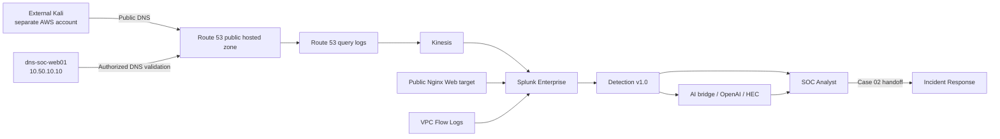

<a id="top"></a>

> 🧭 [Scenario 01](README.md) › **Scenario 01 Runbook — DNS Reconnaissance & Enumeration**


---

# Scenario 01 Runbook — DNS Reconnaissance & Enumeration

**Status:** ✅ Complete  
**Primary MITRE ATT&CK:** `T1590.002 — Gather Victim Network Information: DNS`  
**Cyber Kill Chain:** Reconnaissance  
**Target namespace:** `soclab.abdul4rehman215.tech`

This runbook is the final reproducible record for Scenario 01. It follows the shared 20-part scenario documentation standard and reflects the exercise as executed—not the original planning state.

## Completion matrix

| # | Area | Final state |
|---:|---|---|
| 1 | Objective | ✅ Complete |
| 2 | Architecture | ✅ Complete |
| 3 | Prerequisites | ✅ Complete |
| 4 | Adversary / controlled activity | ✅ Complete |
| 5 | Telemetry | ✅ Validated |
| 6 | Detection | ✅ Detection v1.0 complete |
| 7 | SPL | ✅ Complete |
| 8 | Alert | ✅ Validated |
| 9 | AI Triage | ✅ Validated and human-reviewed |
| 10 | SOC Analysis | ✅ Case 01 + Case 02 complete |
| 11 | Incident Response | ✅ Case 02 complete |
| 12 | Evidence | ✅ Complete |
| 13 | Containment | ✅ Response decision complete — no active containment |
| 14 | Verification | ✅ Evidence-backed closure complete |
| 15 | Results | ✅ Complete |
| 16 | MITRE mapping | ✅ `T1590.002` |
| 17 | False positives / benign context | ✅ Authorized TP demonstrated |
| 18 | Lessons learned | ✅ Complete |
| 19 | Reproduction | ✅ Documented |
| 20 | Screenshots | ✅ Curated |

---

## 1. Objective

Test whether public-authoritative DNS reconnaissance against `soclab.abdul4rehman215.tech` can be:

1. observed in real Route 53 telemetry;
2. separated from normal/background activity by an evidence-based detection;
3. investigated by a SOC Analyst without attacker ground truth;
4. validated and scoped by Incident Response;
5. closed with a proportionate response.

The scenario intentionally includes both a legitimate recon-like case and suspicious external reconnaissance so the analyst must distinguish **behavior** from **authorization**.

---

## 2. Architecture



Important trust boundary:

- the external adversary was outside the defender AWS account;
- no private attacker-to-defender route was used;
- attacker-side telemetry was not required for SOC/IR decisions;
- `observed_dns_source` remained resolver/source evidence rather than guaranteed endpoint identity.

---

## 3. Prerequisites

Before execution:

- Route 53 public hosted zone delegated and healthy;
- `dns-soc-web01` public Web target operational;
- `index=dns_soc_aws` receiving Route 53 Kinesis telemetry;
- Nginx telemetry available in `index=dns_soc_web`;
- VPC Flow telemetry available in `index=dns_soc_aws`;
- Splunk dashboard and Detection v1.0 validated;
- scheduled alert enabled;
- Scenario 01 AI evidence path validated;
- UTC clocks synchronized;
- Project Lead ground-truth capture prepared.

Detection Engineering was frozen before the official cases were executed.

---

## 4. Adversary / controlled activity

### Case 01 — authorized operational validation

Source: defender-owned `dns-soc-web01`.

Business purpose: post-change DNS validation.

Final concentrated activity:

```text
4 names
× 4 DNS types
= 16 authoritative DNS queries

A / AAAA / CNAME / TXT
```

This case was designed to be legitimately useful activity that could still look like reconnaissance to a behavior-based detection.

### Case 02 — external DNS reconnaissance

Source environment: Kali EC2 in a separate AWS account/network.

Adversary sequence:

```text
authority discovery
→ NS / SOA review
→ base-domain record interrogation
→ service/environment name enumeration
→ A / TXT / multi-type checks
→ safe AXFR posture check
```

The external activity remained within reconnaissance scope. No exploitation or destructive action was required.

See [`attacker/PROJECT-LEAD-ADVERSARY.md`](attacker/PROJECT-LEAD-ADVERSARY.md).

---

## 5. Telemetry

### Primary DNS evidence

```text
index=dns_soc_aws
sourcetype=aws:kinesis
```

Important Route 53 fields:

```text
_time
query_name
query_type
response_code
protocol
edge_location
observed_dns_source
edns_client_subnet
```

### Supporting Web evidence

```text
index=dns_soc_web
sourcetype=dns_soc:nginx:access
```

### Supporting network evidence

```text
index=dns_soc_aws
sourcetype=aws:cloudwatchlogs:vpcflow
```

### Cloud / asset context

CloudTrail/SSM and EC2 inventory were useful for Case 01 ownership attribution. They did not provide ownership for Case 02.

---

## 6. Detection

Final hypothesis:

```text
same observed DNS source
+ controlled public namespace
+ concentrated short-window activity
+ query-name breadth
+ meaningful record-type diversity
= possible DNS reconnaissance
```

Final v1.0 condition:

```text
query_count >= 16
AND unique_names >= 4
AND distinct_query_types >= 3
```

`NXDOMAIN` is retained as context and supporting evidence, not a required condition.

Threshold selection came from the measured baseline and controlled tests. It is not presented as a universal DNS threshold.

---

## 7. SPL / Detection Logic

The scenario preserves four categories:

- [`spl/baseline.spl`](spl/baseline.spl)
- [`spl/hunting.spl`](spl/hunting.spl)
- [`spl/detection.spl`](spl/detection.spl)
- [`spl/validation.spl`](spl/validation.spl)

The scheduled-alert configuration is in [`spl/scheduled-alert.md`](spl/scheduled-alert.md).

The SPL uses real Route 53 fields and keeps `observed_dns_source` neutral.

---

## 8. Alert

**Name:** `Scenario 01 - Possible DNS Reconnaissance`

```text
Schedule:        every minute
Lookback:        Last 3 minutes
Trigger:         Number of results > 0
Trigger mode:    Once
Throttle:        60 seconds
Severity:        Medium
Actions:         Triggered Alerts + Webhook
```

The result row includes analyst-ready evidence plus stable fields for the shared AI bridge.

---

## 9. AI Triage

The LLM is downstream of the detection:

```text
Detection v1.0
→ scheduled alert
→ Splunk webhook
→ Scenario 01 evidence contract
→ shared AI bridge
→ structured OpenAI result
→ internal HTTPS HEC
→ index=dns_soc_ai
```

The AI result contains summary, confidence, observed indicators, suspicion reasons, MITRE suggestion, Kill Chain stage, missing evidence and response considerations.

`human_validation_required=true` remains part of the design.

Human rule:

```text
AI statement → What raw evidence proves this? → Human decision
```

---

## 10. SOC Analysis

### Case 01

Observed:

```text
100.49.192.164
16 queries
4 names
4 types
08:41:55 UTC
```

SOC verified the raw events and timeline, then used defender cloud/asset evidence to map the source to `dns-soc-web01` and confirm authorization.

**Disposition:** Authorized / Benign True Positive  
**Confidence:** High  
**Escalation:** None

### Case 02

Observed:

```text
54.242.155.119  (Route 53-observed source/resolver)
53 queries
17 names
6 types
44 NXDOMAIN / 9 NOERROR
10:21:51–10:22:34 UTC
```

SOC reconstructed staged service-name enumeration, confirmed first-seen behavior in the available baseline and found no known defender ownership/authorization correlation.

**Disposition:** True Positive — Suspicious / Likely Unauthorized DNS Reconnaissance  
**Confidence:** High  
**Risk:** Medium  
**Escalation:** Incident Response

See [`soc/SOC-ANALYST-INVESTIGATION.md`](soc/SOC-ANALYST-INVESTIGATION.md).

---

## 11. Incident Response

Lubaba independently validated the Case 02 handoff.

IR work:

```text
reproduce SOC facts
→ validate 7-day history
→ expand DNS timeline
→ inspect Nginx follow-up
→ correlate VPC Flow
→ compare peer DNS sources
→ review public Route 53 records
→ decide response
```

Findings:

- DNS reconnaissance confirmed;
- no continued activity from the same observed DNS source in scoped extended window;
- one later Nginx `GET /` request existed from a separate web client;
- VPC Flow corroborated that web connection to `10.50.10.10` on TCP 80/443;
- no evidence proved that web client was the original endpoint behind the DNS source;
- no exploit-like Web sequence was established;
- public DNS records were expected/benign;
- no evidence justified expanding the case beyond Reconnaissance.

See [`ir/INCIDENT-RESPONSE.md`](ir/INCIDENT-RESPONSE.md).

---

## 12. Evidence

Evidence is organized by role and case:

```text
screenshots/
├── detection-engineering/
├── attacker/
│   ├── case-01/
│   └── case-02/
├── soc/
│   ├── case-01/
│   └── case-02/
└── ir/
    └── case-02/
```

Master map: [`evidence/README.md`](evidence/README.md)

---

## 13. Containment

Case 01 required no containment because it was authorized.

Case 02 did **not** result in an active block.

Final IR response:

> **PRESERVE + MONITOR ONLY — NO ACTIVE CONTAINMENT**

Reason:

- Route 53-observed source was resolver/source evidence, not a proven original endpoint;
- malicious Web progression was not established;
- public DNS exposure was intentional/limited;
- an unsupported block could create collateral impact.

The response decision itself is part of the scenario result.

---

## 14. Verification

Because no active control was changed, verification focused on evidence-backed closure rather than a before/after block.

IR verified:

- the SOC metrics were reproducible;
- the source history and expanded DNS window;
- supporting Web/VPC evidence;
- peer-source behavior;
- public hosted-zone contents;
- absence of evidence for progression beyond reconnaissance.

No configuration change was needed to prove the incident had been handled correctly.

---

## 15. Results

| Case | Result | Response |
|---|---|---|
| Case 01 | Detection correct; activity authorized | SOC closure |
| Case 02 | Detection correct; suspicious external reconnaissance | IR validation + Preserve/Monitor |

The complete scenario passed the intended operating chain:

```text
Behavior → Telemetry → Detection → Alert → AI → SOC → IR → Response decision
```

---

## 16. MITRE ATT&CK Mapping

Primary technique:

`T1590.002 — Gather Victim Network Information: DNS`

Cyber Kill Chain stage:

`Reconnaissance`

No later technique was added because exploitation, Initial Access, persistence, C2 and impact were not demonstrated.

---

## 17. False Positives / Benign Patterns

Scenario 01 intentionally demonstrated the difference between:

**Authorized / Benign True Positive**  
The detection correctly identified reconnaissance-like behavior, but the activity had an approved purpose.

**False Positive**  
The detection would be wrong about the behavior itself.

Case 01 was the first category, not the second.

---

## 18. Lessons Learned

### Detection

- Baseline before threshold.
- Record-type diversity alone is too weak.
- NXDOMAIN is context, not proof.
- Preserve neutral source semantics.

### SOC

- Investigate ownership and authorization separately from behavior.
- A detection row is the start of the case, not the disposition.
- Validate AI claims against raw telemetry.

### IR

- Correlation is not attribution.
- Raw-field parsing is preferable to assuming telemetry is absent.
- No active containment can be the correct response when the control target is not established.

### Exercise design

- Separate attacker ground truth from defender decisions.
- Do not tune a frozen detection during live execution.
- Include at least one legitimate case that crosses the detection boundary.

---

## 19. Reproduction Instructions

1. Validate Route 53, Kinesis, Splunk, Nginx and VPC Flow telemetry.
2. Confirm Detection v1.0 and scheduled alert are enabled and unchanged.
3. Confirm the Scenario 01 dashboard and AI path are operational.
4. Prepare private ground-truth capture.
5. Run Case 01 authorized DNS validation from the defender-owned source.
6. Allow SOC to investigate and close the case independently.
7. Run Case 02 external reconnaissance from the separate-account Kali host.
8. Allow SOC to investigate and create an IR handoff if evidence supports escalation.
9. IR independently validates and scopes the case.
10. Record response decision and final comparison.

Detailed role instructions:

- [`attacker/SCENARIO-01-ADVERSARY-PLAYBOOK.md`](attacker/SCENARIO-01-ADVERSARY-PLAYBOOK.md)
- [`soc/SOC-ANALYST-PLAYBOOK.md`](soc/SOC-ANALYST-PLAYBOOK.md)
- [`exercise/REALISTIC-EXERCISE-PROTOCOL.md`](exercise/REALISTIC-EXERCISE-PROTOCOL.md)

---

## 20. Screenshots

Curated visual evidence is indexed in [`screenshots/README.md`](screenshots/README.md).

The flagship stories intentionally use fewer screenshots than the evidence folders. The evidence folders preserve the deep record; the narrative documents show only the images needed to understand the reasoning.

---

## Final scenario status

> **Scenario 01 — Complete**

Detection Engineering, adversary execution, SOC investigation, Incident Response validation, response decision, evidence organization and final comparison are all documented.

---

<div align="center">

[🏠 Scenario Home](README.md) · [🏗️ Infrastructure](https://github.com/DNSentinel-Lab/DNS-Lab-Infrastructure) · [⬆ Back to top](#top)

<sub>DNSentinel Lab · Evidence-first DNS security engineering</sub>

</div>
