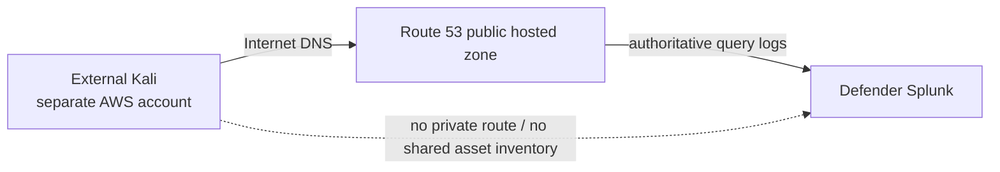
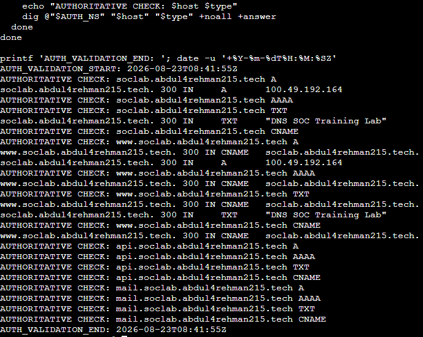
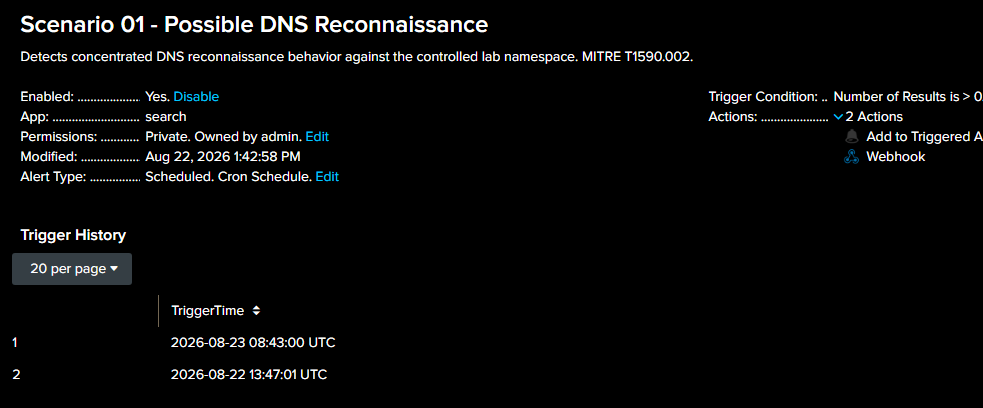
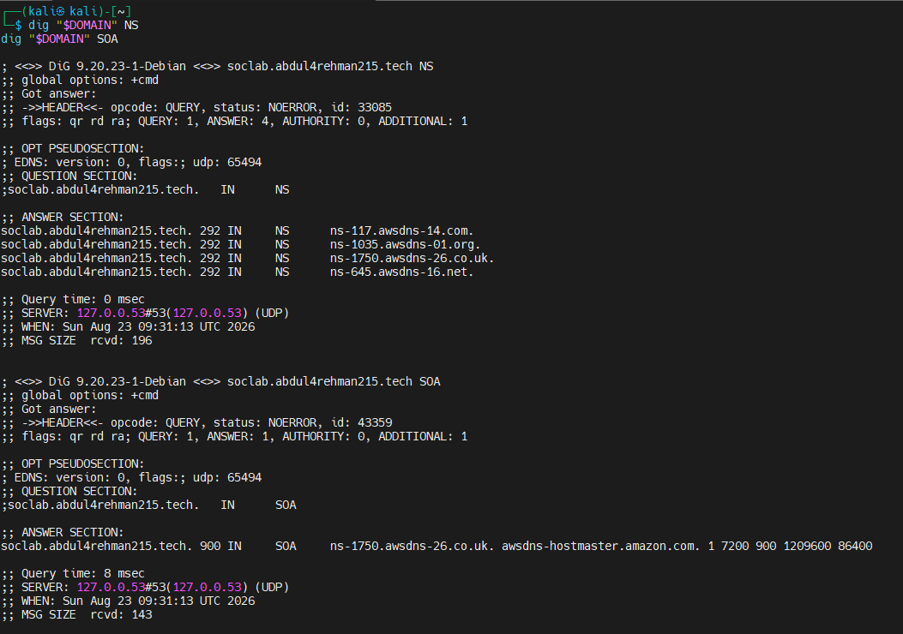
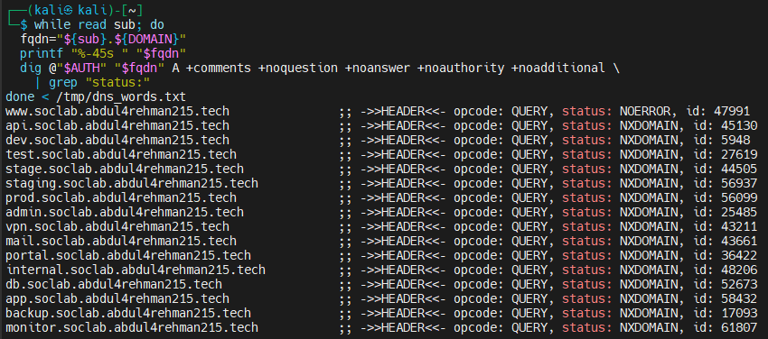
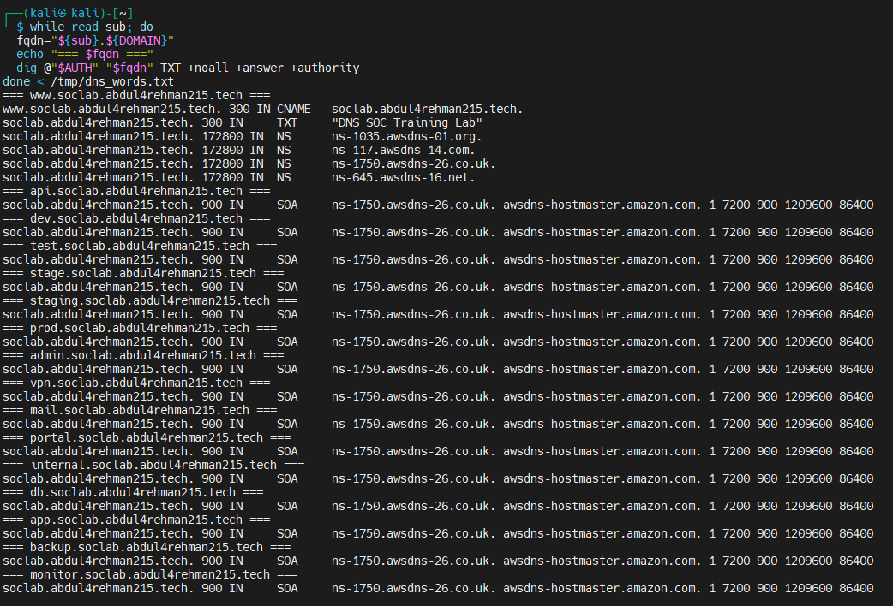
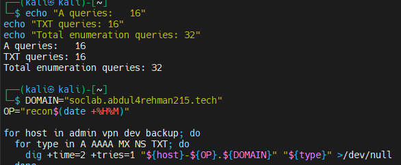

# Project Lead / Adversary — Scenario 01 DNS Reconnaissance

**Role owner:** [Abdul-Rehman](https://github.com/abdul4rehman215)  
**Scenario:** DNS Reconnaissance & Enumeration  
**MITRE ATT&CK:** `T1590.002 — Gather Victim Network Information: DNS`  
**Cyber Kill Chain:** Reconnaissance

This document records the Project Lead / Adversary side of Scenario 01: how the exercise was prepared, how the two cases were generated, what the attacker was trying to learn, and how ground truth was kept separate from the defender investigation.

It is intentionally not a transcript of every command or troubleshooting step. The focus is the adversary objective, execution logic and evidence that mattered to the final scenario.

## 1. Role objective

The adversary role had two responsibilities:

1. create realistic DNS behavior over real public paths;
2. preserve ground truth without contaminating SOC or IR decisions.

The external attack path used a Kali EC2 instance in a **different AWS account and network** from the defender environment. There was no private route or defender-account asset context that could reveal the attacker to the SOC Analyst.



## 2. Ground-truth discipline

Before live activity, the Project Lead recorded privately:

```text
case_id
source machine
source public IP
business / adversary purpose
UTC start and end
commands
queried names and types
important output
screenshots
```

This record was not used by the SOC Analyst to decide whether an alert was benign or malicious.

## 3. Case 01 — authorized DNS validation

### Purpose

Case 01 was designed to prove that **legitimate operational activity can look reconnaissance-like**.

Source asset:

```text
dns-soc-web01
Defender-owned public Web/Nginx EC2
Business purpose: post-change DNS validation
```

The final authoritative validation used four meaningful names and four DNS types:

```text
soclab.abdul4rehman215.tech
www.soclab.abdul4rehman215.tech
api.soclab.abdul4rehman215.tech
mail.soclab.abdul4rehman215.tech

A
AAAA
TXT
CNAME
```



*The final Case 01 activity began at 08:41:55 UTC and created the concentrated pattern that Detection v1.0 observed.*

### Why this case mattered

The Project Lead did not label the traffic for the analyst. From the SIEM's perspective, it was simply a source generating a concentrated, multi-name, multi-type DNS burst.

The alert fired, and only later did the SOC investigation connect the source to the owned asset and approved purpose.



**Ground-truth result:** authorized operational activity.  
**SOC result:** Authorized / Benign True Positive.

The distinction is important: the rule was not wrong. The activity genuinely matched its behavioral hypothesis.

## 4. Case 02 — external reconnaissance

### Attacker objective

The external adversary knew a public domain and attempted to answer reconnaissance questions such as:

```text
Who is authoritative for the zone?
Which records exist on the base domain?
Which service-style names exist?
Which names return NXDOMAIN?
Is TXT metadata exposed?
Is IPv6 present?
Can the zone be transferred?
```

The objective was information gathering, not exploitation.

### Phase A — identify the authority and zone



The attacker established the Route 53 authority and inspected NS/SOA behavior before broad enumeration.

### Phase B — enumerate service-style A records

A small word list was used against meaningful service/environment labels rather than an Internet-scale scanner.



The output demonstrates the pattern that matters to the defender: one valid public name mixed with many NXDOMAIN service guesses such as `api`, `dev`, `stage`, `prod`, `admin`, `vpn`, `mail`, `portal`, `internal`, `db`, `app`, `backup` and `monitor`.

### Phase C — inspect TXT / zone metadata behavior



The exercise also tested whether the queried names exposed TXT/authority information. This remained reconnaissance and did not change or exploit DNS records.

### Phase D — add record-type diversity

The external sequence included additional A/AAAA/MX/NS/TXT checks across several service names.



This mirrors how an analyst might see a reconnaissance actor move from broad name discovery into deeper record interrogation.

## 5. Scope boundary

Scenario 01 stopped at information gathering.

Allowed:

- public DNS authority discovery;
- NS/SOA/A/AAAA/MX/TXT checks;
- plausible service-name enumeration;
- safe AXFR capability check;
- limited non-destructive public-web observation when used for correlation.

Not part of the scenario:

- exploitation;
- credential attacks;
- persistence;
- malware;
- denial of service;
- destructive changes;
- unrelated Internet targets.

## 6. What the adversary learned

The exercise confirmed that public DNS can reveal useful reconnaissance context even when most guessed names do not exist:

- authoritative nameservers and SOA metadata;
- existence/non-existence of service-style labels;
- public base-domain and `www` behavior;
- TXT training-lab metadata;
- record-type availability;
- zone-transfer posture.

The defender later confirmed that the public hosted zone contained only the expected A, NS, SOA, TXT and `www` CNAME records.

## 7. What made the exercise realistic

The strongest realism came from **separation of knowledge**, not from creating noisy attack volume.

The Project Lead knew what was being generated. Musfira did not. Lubaba received the SOC handoff rather than attacker ground truth. This meant the defender had to decide from the same types of evidence a real team would have: target-side DNS logs, SIEM context, cloud asset evidence, Nginx, VPC Flow and analyst judgement.

## 8. Adversary lessons

- A realistic adversary objective is more useful than generating traffic purely to cross a threshold.
- Public authoritative DNS can expose reconnaissance value without any access to the defender account.
- Resolver behavior can separate the original client from the source visible in Route 53 logs.
- The same behavioral pattern can represent authorized operations or suspicious reconnaissance; source/business context is what separates the cases.
- Ground truth is most useful when it is revealed after the defender decision, not before it.

## 9. Related files

- [`SCENARIO-01-ADVERSARY-PLAYBOOK.md`](SCENARIO-01-ADVERSARY-PLAYBOOK.md) — reproducible adversary sequence
- [`ground-truth-template.md`](ground-truth-template.md) — controller evidence template
- [`../SCENARIO-01-EXECUTION.md`](../SCENARIO-01-EXECUTION.md) — complete scenario story
- [`../exercise/final-comparison.md`](../exercise/final-comparison.md) — attacker vs telemetry vs defender comparison
