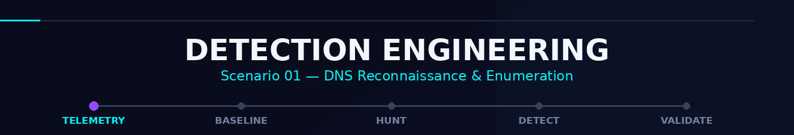

<a id="top"></a>

<div align="center">



<br/>


</div>

<div align="center">


[🏠 Scenario Home](../README.md) · [📊 Dashboard](../dashboard/README.md) · [🔎 SPL Workspace](../spl/README.md) · [🤖 AI Mapping](../ai/README.md) · [🖼️ Evidence](../screenshots/README.md)

</div>


**Detection Engineer:** [Sonia](https://github.com/sonia11mansha415)  
**Status:** **✅ Detection Engineering complete**  
**Primary MITRE ATT&CK:** `T1590.002 — Gather Victim Network Information: DNS`  
**Production rule:** `Scenario 01 - Possible DNS Reconnaissance` · `v1.0`

This workspace records how Sonia turned real Route 53 authoritative DNS telemetry into a detection the SOC could actually investigate and trust. The work moved through field mapping, ingestion timing, baselining, dashboard engineering, hunting, threshold design, positive and benign validation, scheduled alerting, raw-event drilldown and the Scenario 01 AI evidence path.

> [!NOTE]
> This was Sonia's first end-to-end Detection Engineering assignment. The final rule was not copied from a generic threshold: it was built from the lab's own telemetry, tested against both sides of the boundary, and frozen before the official Scenario 01 exercise.

## 🚦 Start here

| Artifact | What it contains |
|---|---|
| [`DETECTION-ENGINEERING.md`](DETECTION-ENGINEERING.md) | **Flagship engineering story** — the complete journey from raw DNS telemetry to analyst-ready alerting, including the important troubleshooting and lessons learned. |
| [`detection-engineering-validation.md`](detection-engineering-validation.md) | **Acceptance record** — the validation matrix used to declare Detection Engineering ready for the official exercise. |

## 🔁 Engineering path

```mermaid
flowchart LR

    %% =====================================================
    %% PHASE 1 — DATA FOUNDATION
    %% =====================================================
    subgraph DATA[" "]
        direction TB

        DH["📡 1 · DATA FOUNDATION"]

        A["🌐 Route 53<br/>Telemetry"]
        B["🧩 Field<br/>Mapping"]
        C["⏱️ Ingestion<br/>Timing"]
        D["📊 Clean<br/>Baseline"]

        DH --> A --> B --> C --> D
    end


    %% =====================================================
    %% PHASE 2 — DETECTION ENGINEERING
    %% =====================================================
    subgraph BUILD[" "]
        direction TB

        BH["🛠️ 2 · DETECTION ENGINEERING"]

        E["🔎 Dashboard<br/>+ Hunts"]
        F["🛡️ Detection<br/>v1.0"]
        G["✅ Positive + Benign<br/>Validation"]
        H["🚨 Scheduled<br/>Alert"]

        BH --> E --> F --> G --> H
    end


    %% =====================================================
    %% PHASE 3 — SOC READINESS
    %% =====================================================
    subgraph READY[" "]
        direction TB

        RH["🎯 3 · SOC READINESS"]

        I["🔬 Raw Evidence<br/>Drilldown"]
        J["🤖 AI Evidence<br/>Contract"]
        K["🏁 SOC-Ready"]

        RH --> I --> J --> K
    end


    %% =====================================================
    %% PHASE-TO-PHASE FLOW
    %% Connect containers, not internal nodes.
    %% This keeps each phase compact and prevents
    %% arrows from crossing heading text.
    %% =====================================================
    DATA --> BUILD
    BUILD --> READY


    %% =====================================================
    %% HEADER STYLES
    %% =====================================================
    classDef dataHeader fill:#083344,stroke:#38bdf8,stroke-width:2px,color:#ffffff;
    classDef buildHeader fill:#3b0764,stroke:#c084fc,stroke-width:2px,color:#ffffff;
    classDef readyHeader fill:#052e16,stroke:#4ade80,stroke-width:2px,color:#ffffff;

    class DH dataHeader;
    class BH buildHeader;
    class RH readyHeader;


    %% =====================================================
    %% NODE STYLES
    %% =====================================================
    classDef telemetry fill:#0c4a6e,stroke:#38bdf8,stroke-width:2px,color:#ffffff;
    classDef mapping fill:#172554,stroke:#60a5fa,stroke-width:2px,color:#ffffff;
    classDef timing fill:#312e81,stroke:#818cf8,stroke-width:2px,color:#ffffff;
    classDef baseline fill:#134e4a,stroke:#2dd4bf,stroke-width:2px,color:#ffffff;

    classDef hunting fill:#3b0764,stroke:#c084fc,stroke-width:2px,color:#ffffff;
    classDef detection fill:#4c1d95,stroke:#a78bfa,stroke-width:2px,color:#ffffff;
    classDef validation fill:#713f12,stroke:#fbbf24,stroke-width:2px,color:#ffffff;
    classDef alert fill:#7f1d1d,stroke:#f87171,stroke-width:2px,color:#ffffff;

    classDef evidence fill:#164e63,stroke:#22d3ee,stroke-width:2px,color:#ffffff;
    classDef ai fill:#581c87,stroke:#e879f9,stroke-width:2px,color:#ffffff;
    classDef final fill:#14532d,stroke:#4ade80,stroke-width:3px,color:#ffffff;

    class A telemetry;
    class B mapping;
    class C timing;
    class D baseline;

    class E hunting;
    class F detection;
    class G validation;
    class H alert;

    class I evidence;
    class J ai;
    class K final;


    %% =====================================================
    %% CONTAINER STYLES
    %% =====================================================
    style DATA fill:#0d1117,stroke:#38bdf8,stroke-width:1px
    style BUILD fill:#0d1117,stroke:#c084fc,stroke-width:1px
    style READY fill:#0d1117,stroke:#4ade80,stroke-width:1px

    linkStyle default stroke:#94a3b8,stroke-width:2px
```



The finish line was not simply **"the SPL returned a result."** The rule had to survive validation, run automatically, expose useful evidence, preserve a raw-event path, and hand structured context to the shared AI bridge without giving AI decision authority.

## 🎯 Final detection boundary

```text
query_count >= 16
AND unique_names >= 4
AND distinct_query_types >= 3
```

`NXDOMAIN` is preserved as investigation context, but it is **not required** for the rule to fire.

<details>
<summary><strong>Why these conditions?</strong></summary>
<br/>

The measured baseline reached a maximum of **15 queries** and **3 unique names** in a source/window. Background activity also reached high record-type diversity, which proved that record-type diversity by itself was too noisy. The final logic therefore combines query concentration, name breadth and type diversity rather than trusting one indicator.

</details>

## ✅ What was validated

| Engineering gate | Result |
|---|---|
| Route 53 field mapping and neutral source semantics | ✅ Complete |
| Current ingestion timing and backlog analysis | ✅ Complete |
| 24-hour normal baseline | ✅ Complete |
| Splunk Dashboard Studio investigation surface | ✅ Complete |
| Hunting summary + raw-event pivot | ✅ Complete |
| Detection `v1.0` | ✅ Complete |
| Controlled positive test | ✅ PASS |
| Benign / false-positive test | ✅ PASS |
| Reusable validation SPL | ✅ Complete |
| Scheduled alert + trigger history | ✅ Validated |
| Analyst evidence row + raw-event drilldown | ✅ Validated |
| Webhook / AI evidence contract | ✅ Validated |
| OpenAI → HEC → `dns_soc_ai` return path | ✅ Validated |

## 📊 Analyst-facing result


*The dashboard was engineered as an investigation surface, not decoration: source-aware DNS KPIs, time behavior, query patterns and raw-event pivots all support the same detection story.*

## 🧩 Connected workspaces

```text
Detection Engineering
├── ../spl/          → baseline, hunts, production detection, validation, scheduled alert
├── ../dashboard/    → analyst investigation surface
├── ../ai/           → Scenario 01 evidence contract and AI mapping
└── ../screenshots/  → curated engineering and troubleshooting evidence
```

- [`../spl/README.md`](../spl/README.md) — final SPL artifacts and rule logic.
- [`../dashboard/README.md`](../dashboard/README.md) — Dashboard Studio implementation and analyst pivots.
- [`../ai/scenario-01-ai-mapping.md`](../ai/scenario-01-ai-mapping.md) — stabilized alert-to-AI evidence contract.
- [`../screenshots/detection-engineering/`](../screenshots/detection-engineering/) — field mapping, baseline, dashboard, hunts, validation, alert and AI-path evidence.

<details>
<summary><strong>🧰 Troubleshooting that shaped the engineering</strong></summary>
<br/>

Three reusable lessons were preserved in the flagship record:

1. **Missing fresh telemetry:** the detection was protected while Sonia traced Kinesis checkpoint and Splunk KV Store health instead of rewriting known-good SPL.
2. **Webhook reached the bridge but failed schema validation:** transport success was separated from payload-contract success, then the final alert fields were normalized.
3. **AI event existed but the first table looked empty:** nested `alert.*` and `ai.*` JSON was inspected and extracted correctly rather than treating the producer as broken.

The pattern stayed consistent: **prove the working layer → isolate the failing boundary → change one thing → validate recovery.**

</details>

## 🧠 Engineering principle

<div align="center">

### **A detection is unfinished until an analyst can explain why it fired.**

</div>

```text
Raw telemetry = truth source
Detection      = behavioral lead
Dashboard      = investigation surface
AI             = advisory context
Human analyst  = security decision
```

Detection v1.0 was frozen before the final exercise and then used unchanged for both official Scenario 01 cases: one was closed by SOC as an **Authorized / Benign True Positive**, while the external reconnaissance case was escalated for independent IR validation.


<div align="center">

**DNSentinel Scenario 01 · Detection Engineering · Sonia**

[🏠 Scenario Home](../README.md) · [📖 Full Engineering Story](DETECTION-ENGINEERING.md) · [✅ Validation Record](detection-engineering-validation.md) · [⬆ Back to top](#top)

<sub>Evidence-first DNS security engineering · Build → Validate → Operationalize → Hand off</sub>

</div>

<div align="center">

**DNSentinel Scenario 01 · Detection Engineering · Evidence before verdict**

</div>
