# Scenario 01 Detection Engineering — From Raw DNS Telemetry to Analyst-Ready Alerting

**Detection Engineer:** [Sonia](https://github.com/sonia11mansha415)  
**Scenario:** DNS Reconnaissance & Enumeration  
**Primary MITRE ATT&CK:** `T1590.002 — Gather Victim Network Information: DNS`  
**Engineering status:** **Complete**  
**Full scenario status:** Official SOC investigation / IR exercise still pending

This document records the Detection Engineering work that turned raw Route 53 authoritative DNS telemetry into a validated Splunk detection, scheduled alert, analyst investigation path and Scenario 01 AI evidence flow.

It keeps the engineering decisions, useful evidence, important failures and lessons that another Detection Engineer should be able to reproduce.

> [!NOTE]
> This was Sonia's first end-to-end Detection Engineering assignment. The work started without a prebuilt rule or pre-labelled attacker field. The detection was developed from observed telemetry, baseline behavior and controlled validation.

---

## 1. Engineering finish line

The Detection Engineering phase was considered ready only after this chain worked:

```text
real Route 53 events
    → field mapping and source semantics
    → ingestion timing
    → normal baseline
    → investigation dashboard
    → hunting SPL
    → behavioral detection
    → controlled positive test
    → benign / false-positive test
    → final detection v1.0
    → validation SPL
    → scheduled alert
    → analyst-ready evidence row
    → raw-event drilldown
    → Scenario 01 AI payload mapping
    → AI result returned to Splunk
```

The official synchronized Scenario 01 exercise is a later phase. The controlled queries used here were **Detection Engineering validation traffic**.

---

## 2. Start with the telemetry, not assumptions

### What Sonia did

The first task was to inspect the real Route 53 public-authoritative events already arriving through:

```text
index=dns_soc_aws
sourcetype=aws:kinesis
```

The raw event structure was inspected and normalized at search time.

The validated fields became:

```text
query_name
query_type
response_code
protocol
edge_location
observed_dns_source
edns_client_subnet
```

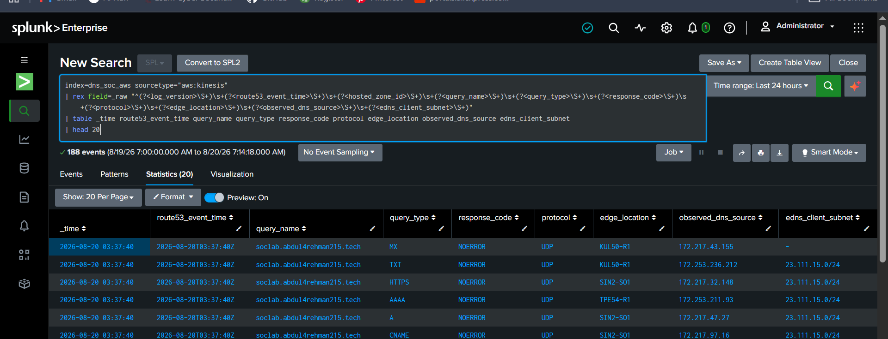

*Raw authoritative DNS events were mapped into stable investigation fields before detection logic was written.*

### Why the source name matters

The address recorded by public authoritative DNS can represent resolver infrastructure rather than the original endpoint that initiated a lookup. For that reason, the field was deliberately named:

```text
observed_dns_source
```

It was **not** renamed `attacker_ip`.

That small naming decision is important Detection Engineering discipline: preserve what the telemetry proves and avoid turning an observed network value into an attribution claim.

### Lesson

**Field semantics are part of detection quality.** A precise field name can prevent analysts from drawing a stronger conclusion than the data supports.

---

## 3. Measure ingestion before choosing alert timing

### What Sonia did

Before creating a scheduled alert, `_time` was compared with `_indextime` to understand how long Route 53 events took to become searchable.

The current delivery path was usually healthy:

- median delivery measured in tens of seconds;
- most fresh events were searchable within roughly one to two minutes.

Two older windows were very different and showed delayed/backlogged delivery of approximately:

```text
12,759 seconds  ≈ 3h 33m
12,974 seconds  ≈ 3h 36m
```

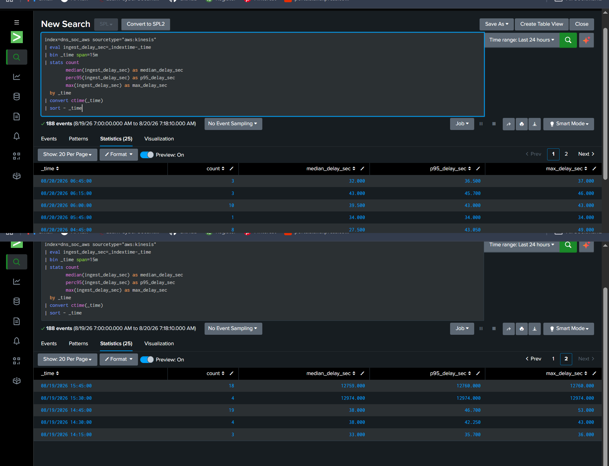

*The latency review separated normal current delivery from older backlog outliers instead of averaging them together.*

### Why this mattered

A scheduled alert that assumes instant ingestion can miss events. A very large lookback, on the other hand, can repeatedly process old activity and create duplicate alerts.

The final alert therefore used an overlapping **Last 3 minutes** search window with a one-minute schedule, informed by the current delivery behavior rather than a guessed value.

### Lesson

**Do not tune the detection because telemetry is late.** First determine whether the issue belongs to the data path, the time window or the detection itself.

---

## 4. Build a baseline before a threshold

### What Sonia did

The baseline measured DNS behavior by observed source and time window before the controlled positive test.

The 24-hour summary contained **97 source/windows** and produced the following observed ranges:

| Metric | Median | 95th percentile | Maximum observed |
|---|---:|---:|---:|
| Query count | 1 | 6 | 15 |
| Unique queried names | 1 | 2 | 3 |
| Distinct query types | 1 | 6 | 8 |

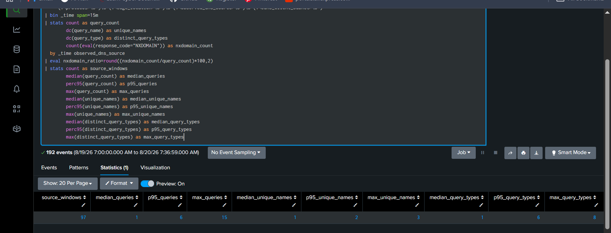

*The baseline showed that public/background DNS can occasionally have high record-type diversity even when query volume and name breadth remain small.*

### The important finding

At first glance, DNS reconnaissance appears easy to detect by looking for many record types such as A, AAAA, MX, NS and TXT.

The baseline disproved that shortcut.

Some background source/windows already reached **six to eight distinct record types**. Therefore:

```text
many DNS record types alone ≠ reconnaissance
```

The final detection had to combine several dimensions:

- concentration in a short window;
- query volume;
- query-name breadth;
- record-type diversity;
- same observed source;
- controlled namespace.

### Lesson

**Baseline data is not just a number used to choose a threshold. It can invalidate a weak detection idea before that idea reaches production.**

---

## 5. Engineer the analyst investigation surface

The dashboard was built before the final alert so Sonia could see how an analyst would investigate the behavior being detected.

### Final dashboard

**Scenario 01 — DNS Reconnaissance Investigation**


The Dashboard Studio implementation contains:

### Shared controls

- Global Time Range
- Observed DNS Source

### SOC summary KPIs

- Distinct Query Types
- Observed DNS Sources
- Total DNS Queries
- Unique Queried Names
- NXDOMAIN Count

### Behavior and pattern views

- DNS Activity Over Time
- Record-Type Diversity Over Time
- Query-Type Distribution
- Top Queried Names
- Response Distribution

### Investigation views

- DNS Investigation Events
- Top 1-Minute DNS Bursts

The exported implementation is stored in:

[`dashboard/scenario-01-dns-recon.dashboard.json`](../dashboard/scenario-01-dns-recon.dashboard.json)

### Why this mattered

The dashboard forced the detection to answer practical SOC questions:

```text
Who was observed querying?
What names were queried?
Which record types were used?
How concentrated was the behavior?
What did Route 53 return?
Which exact events support the summary?
```

The dashboard became an investigation surface used to reason about the rule.

---

## 6. Hunt before detecting

Sonia kept the hunting layer deliberately small. Two searches were enough.

### Hunt 1 — source/window behavior

This search grouped DNS activity into one-minute source/windows and exposed:

- query count;
- unique queried names;
- distinct query types;
- query type list;
- query name samples;
- response context;
- NXDOMAIN count.

No detection threshold was applied.

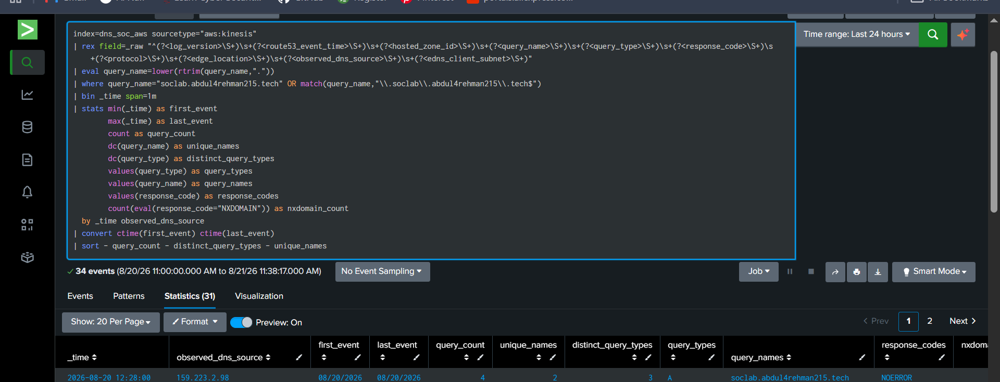

### Hunt 2 — raw DNS evidence pivot

The second hunt returned the individual authoritative DNS events behind a source/window:

```text
_time
observed_dns_source
query_name
query_type
response_code
protocol
edge_location
edns_client_subnet
```

### Why both hunts were needed

```text
behavior summary → explains the pattern
raw-event pivot   → proves what actually happened
```

This distinction later became the basis for alert evidence and analyst drilldown.

The final hunts are preserved in [`spl/hunting.spl`](../spl/hunting.spl).

---

## 7. Turn the hunt into a behavioral hypothesis

The final engineering hypothesis was:

```text
same observed DNS source
+ controlled lab namespace
+ concentrated short-window DNS activity
+ query-name breadth
+ meaningful record-type diversity
→ possible DNS reconnaissance
```

`NXDOMAIN` was kept as supporting evidence, not as a mandatory condition.

That choice matters because reconnaissance can return valid records as well as NXDOMAIN responses. Requiring NXDOMAIN would make the detection describe only one possible outcome instead of the target behavior.

---

## 8. Select the threshold from evidence

The first candidate threshold was positioned just above the observed baseline boundaries:

```text
query_count >= 16
unique_names >= 4
distinct_query_types >= 3
```

Why:

- observed baseline query count reached **15**;
- observed baseline unique names reached **3**;
- record-type diversity alone was already noisy, so the diversity threshold remained modest and was combined with the stronger count/breadth conditions.

The values were provisional until controlled testing proved the rule behaved as intended.

---

## 9. Positive validation — prove the rule can fire

### Controlled engineering traffic

One small reconnaissance-like sequence was generated against the project-owned namespace.

The test produced:

```text
20 queries
4 unique names
5 record types
A, AAAA, MX, NS, TXT
```

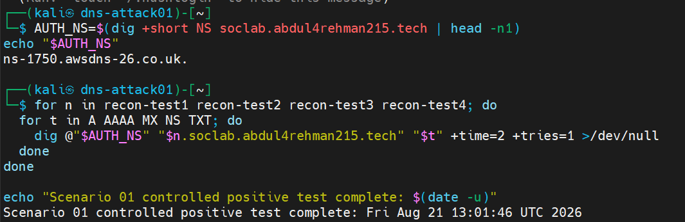

*The positive test was intentionally small and used only the authorized Scenario 01 lab namespace.*

### Detection result

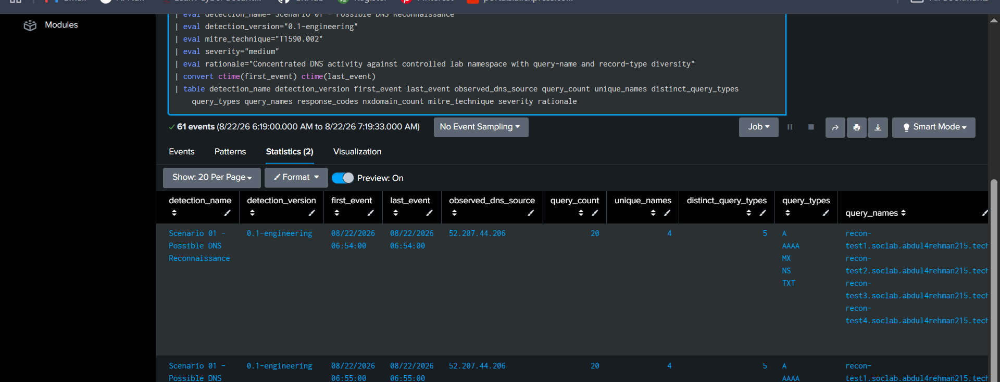

The result crossed the engineering threshold with approximately:

```text
query_count = 20
unique_names = 4
distinct_query_types = 5
```

### What Sonia learned from the first result

A single burst can straddle a one-minute bucket boundary. During testing, that created more than one aggregate row for the same short activity sequence.

Instead of treating the duplicate as proof that the threshold was wrong, the behavior was documented and later controlled operationally through scheduled alert lookback/throttling.

### Result

**Controlled positive validation: PASS.**

---

## 10. Benign validation — prove the rule does not alert on basic DNS use

A minimal benign test used ordinary A/AAAA lookups rather than enumeration across several names and record types.

The exact detection logic was run unchanged.

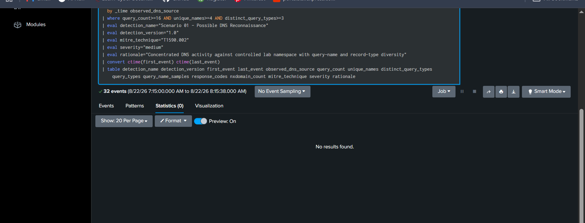

*Basic DNS activity remained below the detection conditions.*

### Result

**Benign / false-positive validation: PASS — no detection row.**

This did not prove the rule could never produce a false positive. It proved the rule did not simply fire on ordinary low-complexity DNS activity and that its conditions represented more than “DNS happened.”

---

## 11. Detection SPL

With the positive and benign behavior separated, the rule was promoted from engineering prototype to:

```text
detection_version = 1.0
severity          = medium
MITRE             = T1590.002
```

The final detection produces approximately one analyst-ready row per source/window instead of raw-event spam.

Core evidence includes:

- detection name/version;
- first/last event time;
- observed DNS source;
- query count;
- unique-name count;
- distinct query-type count;
- query-type list;
- queried-name samples;
- response context;
- NXDOMAIN count;
- MITRE mapping;
- severity/rationale;
- Scenario 01 / AI contract fields.

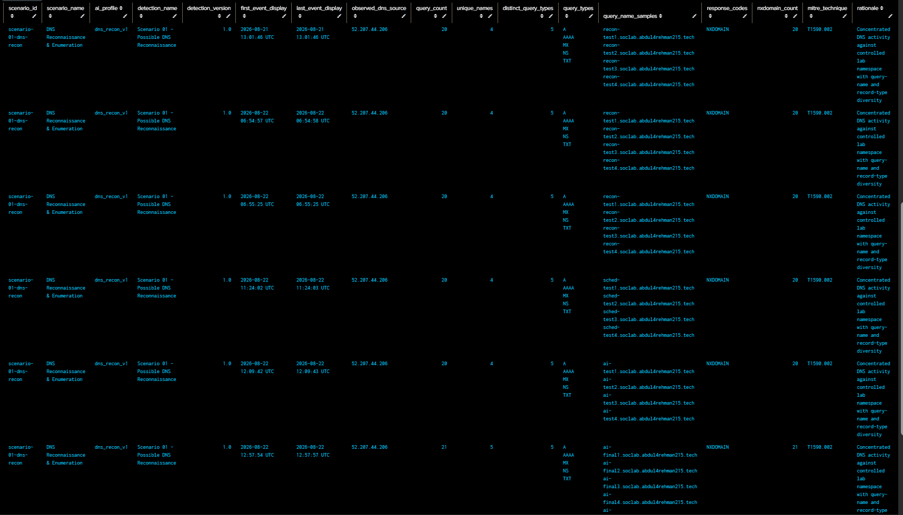

The production search is in [`spl/detection.spl`](../spl/detection.spl).

---

## 12. Preserve a reusable validation search

`validation.spl` does not hide rows that are below threshold. Instead it labels each source/window:

```text
WOULD DETECT
BELOW THRESHOLD
```

That gives the Detection Engineer a fast way to compare current behavior with the final rule without editing the detection itself.

The search is preserved in [`spl/validation.spl`](../spl/validation.spl).

---

## 13. Operationalize the rule as a scheduled alert

A working detection search is not yet an operational alert.

The final scheduled alert is:

```text
Name:            Scenario 01 - Possible DNS Reconnaissance
Cron expression: * * * *
Search lookback: Last 3 minutes
Trigger:         Number of Results > 0
Trigger mode:    Once
Throttle:        60 seconds
Severity:        Medium
Actions:         Add to Triggered Alerts + Webhook
```

The alert was saved in the Search app and validated through actual trigger history.


### Why the three-minute lookback exists

The lookback is intentionally wider than the normal observed tens-of-seconds Route 53 delivery. That overlap reduces the chance of missing a fresh event because it becomes searchable after the scheduler's previous run.

The throttle limits repeated notifications when overlapping scheduled windows include the same burst.

Detailed configuration is preserved in [`spl/scheduled-alert.md`](../spl/scheduled-alert.md).

---

## 14. Validate the analyst evidence and raw-event drilldown

The next acceptance test was not “did the alert page exist?” It was whether an analyst could understand and verify the result.

The triggered alert exposes the summarized evidence row and the underlying Route 53 events can be recovered through the raw-event investigation search.

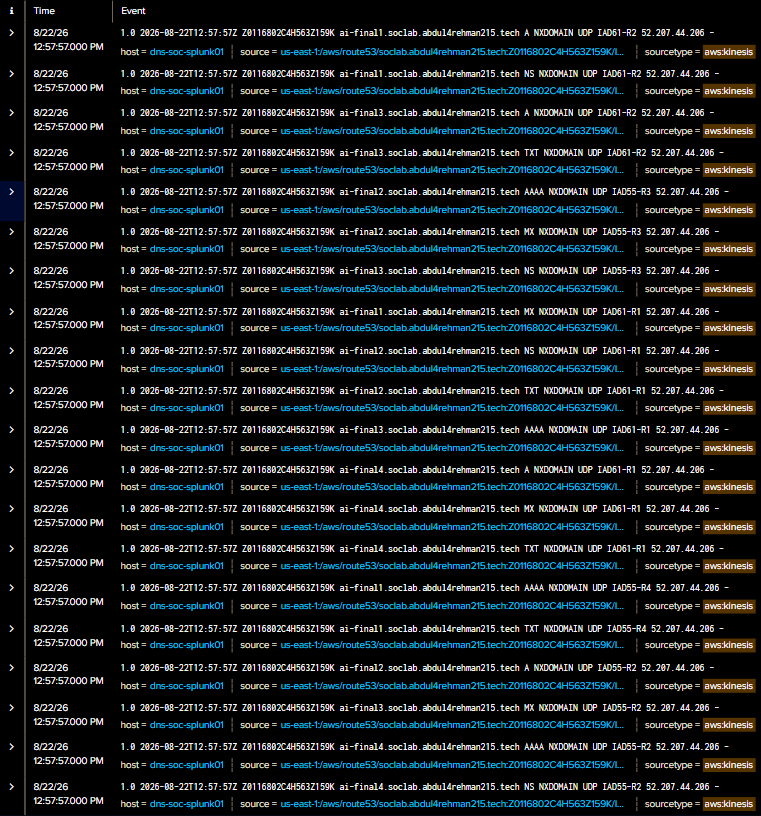

### Analyst workflow

```text
alert row
    → observed source / time / query samples
    → raw Route 53 event pivot
    → exact query name, type, response, protocol and location evidence
```

This preserves direct access to the original telemetry even when later AI assistance is available.

---

## 15. Troubleshooting case study 1 — when the detection was right but telemetry was missing

This was the most important infrastructure troubleshooting sequence during Scenario 01.

### Symptom

A fresh DNS query succeeded against the authoritative service, but the corresponding Route 53 event did not appear in Splunk. Historical `aws:kinesis` data still existed.

The scheduled alert therefore showed zero results even though the detection SPL had already been validated.

### What Sonia avoided

She did **not** immediately change:

- thresholds;
- field extraction;
- dashboard searches;
- scheduled alert logic;
- Docker volumes;
- Kinesis configuration.

The known-good detection was protected while the data path was investigated.

### Evidence

Splunk internal logs showed Kinesis checkpoint failures and KV Store initialization errors.

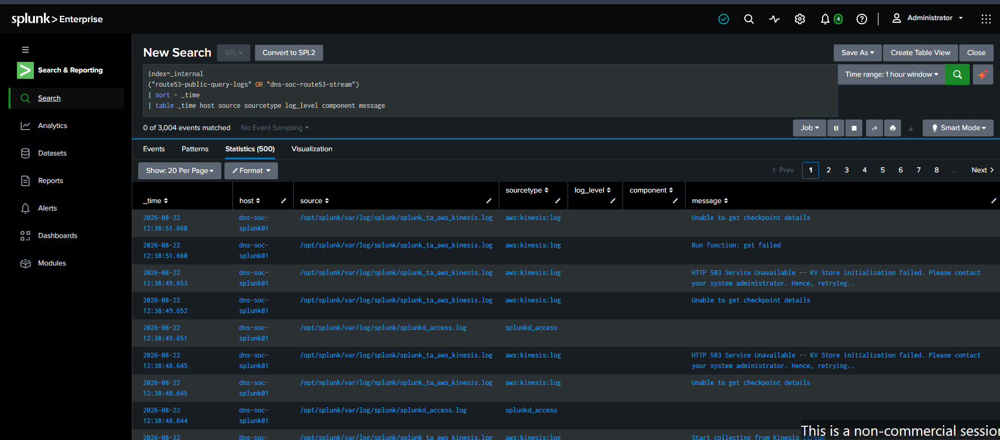

The running host kernel was the newer `7.0.0-1011-aws`, while a compatible `6.17.0-1017-aws` kernel remained installed.

The recovery was deliberately reversible: a one-time GRUB boot into the compatible kernel was used.

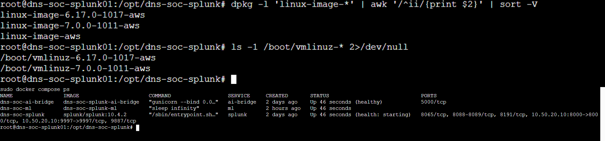

After restart:

- Splunk container recovered;
- KV Store recovered;
- Kinesis checkpointing resumed;
- fresh Route 53 events returned.

### Engineering lesson

**When fresh events disappear, validate the ingestion chain before rewriting a working detection.**

This troubleshooting crossed Splunk, Docker, KV Store/MongoDB, Linux boot/kernel behavior and AWS Kinesis without breaking existing configuration.

---

## 16. Troubleshooting case study 2 — the alert fired but AI rejected the payload

After the scheduled alert was working, the Webhook action still failed to produce AI triage.

### Symptom

The bridge returned:

```text
HTTP 400 BAD REQUEST
schema_validation_failed
```

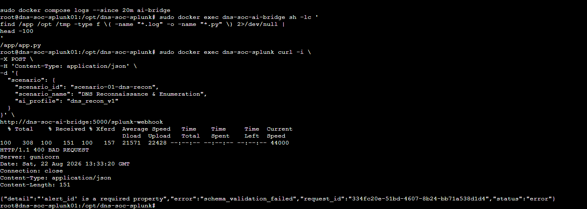

### Diagnosis

This was **not** a Docker networking failure. Splunk could reach the bridge.

The bridge expected a stable alert contract while the Splunk result row still used Scenario-specific field names that did not match the adapter.

Required normalized fields were:

```text
alert_id
alert_name
scenario
severity
event_time
source
evidence_json
```

### Fix

The final detection was extended to generate those fields while preserving the original SOC evidence columns.

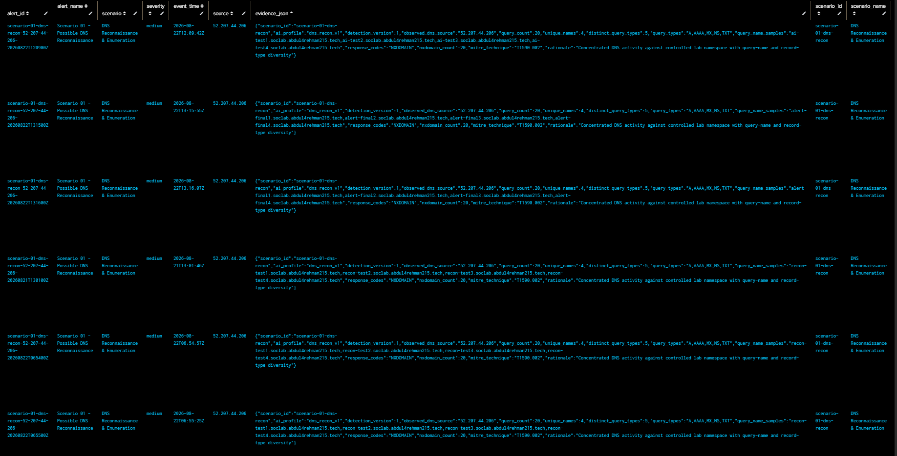

### Engineering lesson

**A reachable endpoint can still represent an integration failure. Separate transport success from schema success.**

---

## 17. Scenario 01 AI evidence mapping

Once the detection fields were stable, Scenario 01 was connected to the shared AI bridge.

Scenario identity:

```text
scenario_id   = scenario-01-dns-recon
scenario_name = DNS Reconnaissance & Enumeration
ai_profile    = dns_recon_v1
```

The evidence contract carries the rule output rather than an attacker narrative or predetermined verdict.

### Final path

```text
Route 53
    → Kinesis
    → Splunk detection v1.0
    → scheduled alert
    → Webhook
    → shared AI bridge
    → OpenAI structured analysis
    → HTTPS HEC
    → index=dns_soc_ai
```

A fresh `bridge-final*` validation burst reached the complete chain. The bridge's OpenAI request returned HTTP 200 and the resulting event appeared in Splunk.

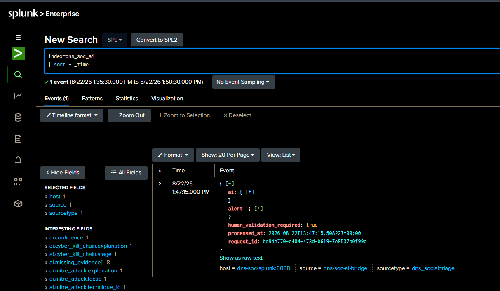

The returned structure includes analyst-assistance fields such as:

- summary;
- confidence;
- observed indicators;
- suspicion reasons;
- MITRE candidate;
- Cyber Kill Chain stage;
- missing evidence;
- response considerations;
- `human_validation_required=true`.

Scenario-specific mapping is documented in [`ai/scenario-01-ai-mapping.md`](../ai/scenario-01-ai-mapping.md).

---

## 18. Troubleshooting case study 3 — AI data existed but the first table looked empty

The AI event was indexed successfully, yet an early `table` command displayed blank columns.

The problem was not missing AI output. The JSON was nested under:

```text
alert.*
ai.*
```

The final analyst search used explicit `spath` extraction and converted multivalue arrays into readable strings.

This was a smaller problem than the KV Store and schema incidents, but it reinforced the same habit:

> Inspect the shape of the actual data before changing the producer.

---

## 19. Engineering reflection

The hardest moments in this build were the ones where the visible symptom appeared in one layer while the real cause belonged to another.

A zero-result alert eventually led into Kinesis checkpointing and KV Store health. A successful alert trigger later led into webhook schema validation. A populated AI event initially looked empty because the table was addressing the wrong JSON paths.

Sonia's most valuable progression was therefore not a single SPL technique. It was learning how to isolate a failing boundary:

```text
protect known-good configuration
    → prove which layer still works
    → inspect evidence at the next boundary
    → change one thing
    → verify recovery
```

By the end of the work, the role covered much more than writing a query. It involved DNS semantics, Splunk SPL, dashboard engineering, baseline analysis, scheduler behavior, internal logs, Linux troubleshooting, Docker services, JSON contracts, Webhooks, OpenAI integration and HEC validation.

The result is stronger because the problems were not hidden. Only the reusable ones are documented here, along with the reasoning that resolved them.

---

## 20. Lessons worth carrying forward

### Detection lessons

- Start with real fields and real source semantics.
- High DNS record-type diversity alone was too noisy in this environment.
- Use several behavioral dimensions rather than a single indicator.
- NXDOMAIN is valuable context but should not define all reconnaissance.
- Preserve a raw-event pivot even when the detection returns a clean summary row.

### Validation lessons

- A rule is not finished because one positive test fires.
- Positive and benign tests must use the same detection logic.
- Keep validation traffic small and controlled.
- Save a reusable validation view rather than repeatedly editing production SPL.

### Alert engineering lessons

- Scheduled-alert timing should reflect actual ingestion behavior.
- Overlapping windows can create repeated triggers; document and control them with alert settings.
- Validate the actual triggered result.

### Troubleshooting lessons

- A detection can be correct while its data source is unhealthy.
- Avoid destructive fixes when a reversible diagnostic path exists.
- Transport success and payload/schema success are separate checks.
- Inspect nested JSON paths before assuming data is missing.

### AI lessons

- Stabilize the human analyst evidence contract first.
- Send evidence to the LLM.
- Keep raw Splunk evidence directly accessible.
- AI output remains advisory; `human_validation_required=true` is part of the design.

---

## 21. Detection Engineering completion record

| Completion gate | Result |
|---|---|
| Route 53 field mapping | ✅ Complete |
| Source semantics | ✅ Complete |
| Ingestion timing | ✅ Complete |
| Normal baseline | ✅ Complete |
| Investigation dashboard | ✅ Complete |
| Hunting SPL | ✅ Complete |
| Detection v1.0 | ✅ Complete |
| Controlled positive validation | ✅ Pass |
| Benign / FP validation | ✅ Pass |
| Validation SPL | ✅ Complete |
| Scheduled alert | ✅ Validated |
| Analyst evidence row | ✅ Validated |
| Raw-event drilldown | ✅ Validated |
| MITRE `T1590.002` | ✅ Preserved |
| Scenario AI contract | ✅ Validated |
| OpenAI / HEC end-to-end path | ✅ Validated |
| Curated repository evidence | ✅ Complete |

### Boundary that remains

This phase does **not** close the full Scenario 01 exercise. The following remain for the synchronized team exercise:

```text
official adversary ground truth
→ SOC Analyst investigation and final disposition
→ official AI-vs-human comparison
→ IR / Defender decision
→ approved containment where applicable
→ post-response verification
→ final scenario report
```

That distinction keeps the repository technically accurate while giving the completed Detection Engineering work its own clear finish line.
