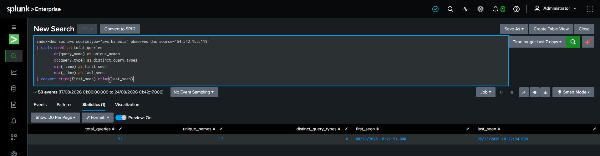
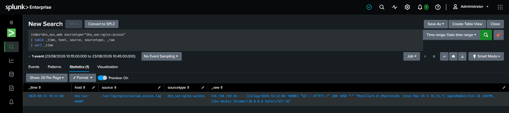
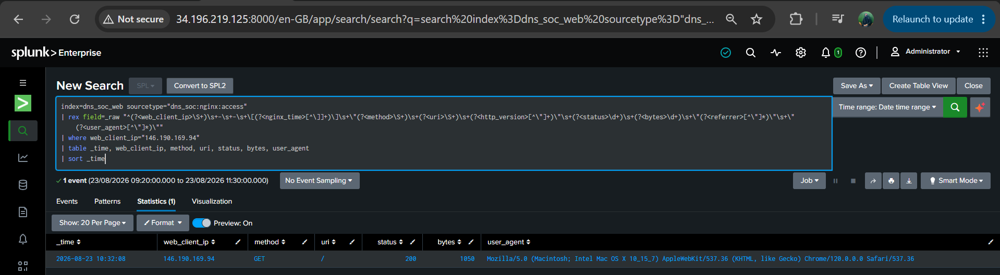
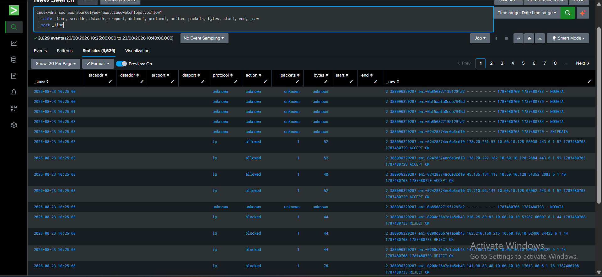

# Incident Response — Scenario 01 Case 02

**Incident Responder / Defender:** [Lubaba](https://github.com/lubaba1513-pixel)  
**Case:** 02 — Suspicious / Likely Unauthorized DNS Reconnaissance  
**MITRE ATT&CK:** `T1590.002 — Gather Victim Network Information: DNS`  
**Cyber Kill Chain:** Reconnaissance  
**Status:** ✅ IR validation complete; case closed with **Preserve + Monitor — No Active Containment**

Lubaba's role began after Musfira transferred an evidence-backed SOC handoff. The objective was not to repeat the entire SOC investigation or to force a block. IR independently validated the escalation, scoped possible follow-on activity, reviewed public exposure and selected a response that matched the evidence.

## 1. SOC handoff received

Musfira handed off:

```text
Disposition: True Positive — Suspicious / Likely Unauthorized DNS Reconnaissance
SOC confidence: High
SOC risk: Medium
Observed DNS source: 54.242.155.119
Observed period: 2026-08-23 10:21:51–10:22:34
53 queries / 17 names / 6 query types
44 NXDOMAIN / 9 NOERROR
MITRE: T1590.002
Kill Chain: Reconnaissance
Ownership / authorization: unresolved
```

IR accepted the case for independent validation but did not treat the SOC conclusion as proof of endpoint identity or a containment instruction.

## 2. Independent acceptance — reproduce the SOC facts

Lubaba reproduced the core metrics directly from Splunk using the original event window.


**Validated:**

- 53 DNS queries;
- 17 unique names;
- 6 query types (`A, AAAA, MX, NS, SOA, TXT`);
- 44 NXDOMAIN;
- 9 NOERROR;
- 83.02% NXDOMAIN;
- UDP;
- `10:21:51–10:22:34`.

This allowed IR to accept the escalation on its evidence, not just on the SOC label.

## 3. Seven-day baseline validation

IR independently confirmed that the observed DNS source appeared only in the Case 02 activity within the available seven-day Route 53 data.



Important wording remained conservative: this established a first-seen Route 53-observed source in the available telemetry. It did not prove the original client was new or malicious.

## 4. Extended DNS timeline

A custom window expanded roughly one hour before and after the original burst.


Only the original activity appeared:

```text
10:21 minute → 6 queries
10:22 minute → 47 queries
Total         → 53 queries
```

No continued DNS activity from the same observed source was found in the scoped window.

## 5. Nginx follow-up investigation

IR then asked a separate question: **did anything touch the public web asset after the DNS reconnaissance?**

The raw Nginx event contained one request at `10:32:08`, around nine and a half minutes after the DNS burst ended.



Lubaba parsed the request into clean fields:

```text
web client: 146.190.169.94
method: GET
URI: /
status: 200
bytes: 1050
user agent: Chrome / macOS
```


A wider window showed only this one request from that client—no repeated requests, HEAD probing, unusual paths, 404 enumeration or exploit-like sequence.



**IR conclusion:** web follow-up existed, but malicious web progression was not proven. The relationship between this web client and the DNS reconnaissance source remained **insufficient evidence**.

## 6. VPC Flow correlation

Initial VPC Flow fields were incomplete, so Lubaba inspected/parsing `_raw` rather than assuming the data was absent.



After extracting the raw flow fields, IR independently corroborated TCP communication between:

```text
146.190.169.94 → 10.50.10.10:80
146.190.169.94 → 10.50.10.10:443
Action: ACCEPT
```


This supported the Nginx event. It still did **not** connect `146.190.169.94` to `54.242.155.119` as one proven original client.

## 7. Compare related DNS sources

Lubaba compared every Route 53-observed source in the same period.


The Case 02 source was the clear outlier at `53 queries / 17 names / 6 types / 44 NXDOMAIN`. Other sources had only small query counts and much smaller breadth.

This supported the classification as isolated DNS reconnaissance within the available evidence.

## 8. Public DNS exposure review

Route 53 logs showed which queries returned `NOERROR`, but the logs did not by themselves expose every answer value. IR therefore moved to a read-only hosted-zone review.


The public zone contained the expected records:

- A record for the public web service;
- NS records;
- SOA;
- TXT value `DNS SOC Training Lab`;
- `www` CNAME to the base domain.

The guessed service names largely returned NXDOMAIN. The record set did not reveal credentials, internal host inventory, account IDs or administrative secrets.

## 9. Attribution discipline

A key IR decision was **what not to claim**.

`54.242.155.119` was treated as the Route 53-observed resolver/source. Public authoritative DNS logging does not automatically prove this is the original endpoint behind the lookup.

Likewise, the Nginx/VPC client `146.190.169.94` was a real web client, but available evidence did not prove it belonged to the same actor that generated the DNS reconnaissance.

This prevented the response from turning a correlation gap into an unsupported block.

## 10. Containment decision

### Finding

Confirmed DNS reconnaissance behavior. No evidence established progression beyond reconnaissance. Original-client attribution remained unresolved. Public DNS exposure was limited and intentional.

### Decision

> **PRESERVE + MONITOR ONLY — NO ACTIVE CONTAINMENT**

### Why this was proportionate

- the Route 53-observed source was not a proven original attacker endpoint;
- no malicious HTTP client was established;
- the one web request was isolated and benign-looking;
- the public hosted-zone records were required or harmless;
- a source block could disrupt legitimate resolver traffic;
- the scenario scope was reconnaissance and no later-stage compromise was demonstrated.

No AWS, DNS, Nginx, security-group or network control was changed simply to create a dramatic containment screenshot.

## 11. Final IR classification

| Area | Final IR result |
|---|---|
| Incident classification | **Confirmed DNS reconnaissance behavior** |
| Scope | Reconnaissance only |
| Original client attribution | Unresolved / insufficient evidence |
| Continued DNS activity | None from same observed source in scoped extended window |
| Web follow-up | One successful root-page request; not proven malicious or linked to DNS source |
| VPC Flow | Corroborated the web connection to `dns-soc-web01` |
| Public DNS exposure | Limited to expected public records |
| Containment | **No active containment** |
| Response | Preserve evidence + continue monitoring |
| MITRE | `T1590.002` |
| Cyber Kill Chain | Reconnaissance |
| Final status | **Closed after IR validation** |

## 12. AI recommendation assessment

IR retained the same human-approval boundary used by SOC.

Any AI response recommendation had to be compared with attribution, scope and business impact. A recommendation to block the Route 53-observed source would have been unsupported because the original endpoint was not established.

AI remained useful for investigation prompts; it did not authorize containment.

## 13. Detection Engineering feedback

The evidence supported the core Detection v1.0 behavior and did not justify changing the frozen threshold after the exercise.

Reusable feedback:

- preserve neutral `observed_dns_source` semantics;
- retain raw-event pivots;
- keep NXDOMAIN as context rather than proof;
- consider web/network follow-up as investigation enrichment, not a required DNS-detection condition;
- continue separating resolver/source observation from endpoint attribution.

## 14. Incident-response reflection

The strongest IR decision in Scenario 01 was not a block. It was knowing when a block was **not** supported.

Lubaba validated the SOC facts, expanded the scope, checked the network and application layers, reviewed what was actually public, and stopped the investigation at the evidence boundary. That prevented a reconnaissance case from being overstated as compromise and prevented an observed resolver from being treated as a confirmed attacker endpoint.

## 15. Related files

- [`case-02-validation.md`](case-02-validation.md) — acceptance matrix and evidence gallery
- [`case-02-final-decision.md`](case-02-final-decision.md) — final response decision
- [`../soc/case-02-soc-investigation-ir-handoff.md`](../soc/case-02-soc-investigation-ir-handoff.md) — source SOC handoff
- [`../exercise/final-comparison.md`](../exercise/final-comparison.md) — final cross-role comparison
