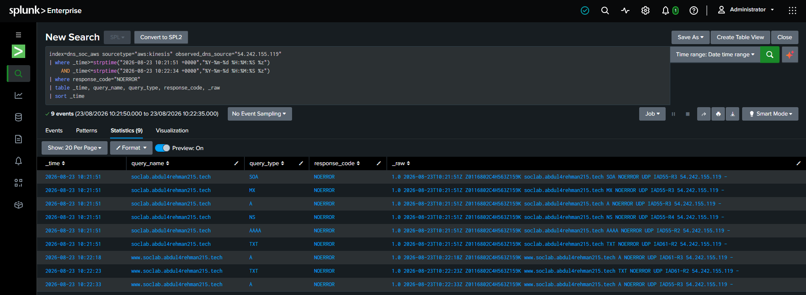

# Case 02 IR Validation / Acceptance Matrix

**Incident Responder:** Lubaba  
**Source handoff:** Musfira — SOC Analyst  
**Final IR response:** **Preserve + Monitor — No Active Containment**

This file records how IR independently accepted, validated and scoped the Case 02 SOC handoff.

## Acceptance matrix

| Question / SOC claim | IR result | Evidence | Status |
|---|---|---|---|
| 53 DNS queries | Reproduced | IR-E01 | ✅ Validated |
| 17 unique queried names | Reproduced | IR-E01 | ✅ Validated |
| 6 query types | A, AAAA, MX, NS, SOA, TXT | IR-E01 | ✅ Validated |
| 44 NXDOMAIN / 9 NOERROR | Reproduced; 83.02% NXDOMAIN | IR-E01 | ✅ Validated |
| Event interval | `10:21:51–10:22:34` | IR-E01 | ✅ Validated |
| First-seen in available 7-day data | Same 53 events only | IR-E02 | ✅ Validated |
| Continued activity after burst | No additional activity from same observed source in scoped extended window | IR-E03 | ✅ Not observed |
| Follow-on web activity | One `GET /` → 200 at 10:32:08 | IR-E04 | ✅ Observed |
| Malicious web progression | No repeated probing / unusual paths / 404 scan from that client | IR-E04 | ❌ Not established |
| Link web client ↔ DNS source | Not proven | IR-E04 / IR-E05 | ⚠️ Insufficient evidence |
| VPC network evidence | TCP 80/443 communication to `10.50.10.10` corroborated | IR-E05 | ✅ Validated |
| Comparable peer DNS behavior | Case 02 source was clear outlier | IR-E06 | ✅ Validated |
| Sensitive public DNS exposure | Expected/benign records only | IR-E07 / IR-E08 | ✅ No sensitive exposure found |
| Progression beyond Reconnaissance | Not established | Combined evidence | ❌ Not established |
| Active containment justified | No | Final decision | ✅ No active containment |

## IR-E01 — Core SOC facts

**Question:** Can IR independently reproduce the alert metrics and exact interval?

**Proves:** the core SOC handoff values were internally consistent and reproducible from Route 53 evidence.

## IR-E02 — Seven-day baseline

**Question:** Was the observed DNS source seen elsewhere in the available seven-day Route 53 data?

**Proves:** all available activity for this observed source belonged to the Case 02 burst. This does not prove original-client identity.

## IR-E03 — Extended DNS timeline

**Question:** Did the same observed DNS source continue before or after the original burst?

**Proves:** only the original 10:21/10:22 activity buckets were present in the scoped expanded window.

## IR-E04 — Nginx follow-up

**Question:** Was there web activity after the DNS reconnaissance, and was it malicious?

**Proves:** one successful `GET /` request existed from `146.190.169.94`; no repeated exploit-like web sequence was established.

## IR-E05 — VPC Flow correlation

**Question:** Does the network layer corroborate the Nginx connection?

**Proves:** the same web client communicated with `dns-soc-web01` private IP `10.50.10.10` on TCP 80/443. It does not prove the client was behind the DNS resolver/source.

## IR-E06 — Related DNS sources

**Question:** Was Case 02 behavior normal among peer DNS sources in the same period?

**Proves:** Case 02 was the clear breadth/volume outlier in the comparison window.

## IR-E07 / E08 — Public DNS exposure

**Question:** What did the public namespace intentionally expose?

Route 53 query logs established which lookups succeeded, but not every returned answer value. IR therefore reviewed the hosted zone directly.

**Proves:** the zone exposed only expected public records and harmless training-lab metadata.

## Final acceptance result

IR accepted the SOC escalation as evidence-backed **DNS reconnaissance**, but did not accept stronger claims of endpoint attribution, malicious web progression or compromise.

**Final response:** **PRESERVE + MONITOR ONLY — NO ACTIVE CONTAINMENT**.
