# Case 01 — SOC Investigation Closure

**Scenario 01 — DNS Reconnaissance & Enumeration**  
**SOC Analyst:** [Musfira](https://github.com/MUSFIRA-ZAFAR)  
**Date:** 2026-08-23  
**Production Detection:** v1.0 (frozen during execution)

[← SOC Workspace](README.md) · [SOC Investigation Story](SOC-ANALYST-INVESTIGATION.md) · [Scenario Execution](../SCENARIO-01-EXECUTION.md)

> [!NOTE]
> Case 01 demonstrates an **Authorized / Benign True Positive**: the detection correctly identified reconnaissance-like behavior, while asset and business context established that the activity was approved.

| **Disposition** | **AUTHORIZED / BENIGN TRUE POSITIVE**     |
|-----------------|-------------------------------------------|
| **Confidence**  | High                                      |
| **Escalation**  | Closed by SOC — no IR escalation required |

# SOC Summary

The frozen Scenario 01 production detection identified
reconnaissance-like DNS activity from observed source 100.49.192.164.
Human investigation confirmed a concentrated 16-query burst across four
names and four DNS record types. Defender-side AWS evidence then
attributed the public source to the known SOC lab EC2 asset
dns-soc-web01 (instance i-077d7b9a9de0b1387; private IP 10.50.10.10;
SOC-LAB-VPC / SOC-TARGET-SUBNET). The lab owner confirmed the activity
was approved. The detection was therefore correct, but the activity was
authorized rather than malicious.

| **Observed source**  | 100.49.192.164                                     |
|----------------------|----------------------------------------------------|
| **Alert time**       | 2026-08-23 08:41:55                                |
| **Detection values** | 16 queries / 4 unique names / 4 query types        |
| **Query types**      | A, AAAA, CNAME, TXT                                |
| **Target namespace** | soclab.abdul4rehman215.tech                        |
| **Mapped asset**     | dns-soc-web01 — i-077d7b9a9de0b1387 — 10.50.10.10  |
| **MITRE**            | T1590.002 — Gather Victim Network Information: DNS |
| **Kill Chain**       | Reconnaissance                                     |

# 5W1H Framework

| **Who**   | Observed source 100.49.192.164, attributed through CloudTrail/SSM and resolver evidence to dns-soc-web01 (i-077d7b9a9de0b1387), private IP 10.50.10.10. |
|-----------|---------------------------------------------------------------------------------------------------------------------------------------------------------|
| **What**  | 16 DNS queries across 4 unique names and 4 record types (A, AAAA, CNAME, TXT), with NOERROR and NXDOMAIN responses.                                     |
| **When**  | 2026-08-23 08:41:55; all 16 queries occurred in the same one-second bucket.                                                                             |
| **Where** | Public authoritative namespace soclab.abdul4rehman215.tech; asset resides in SOC-LAB-VPC / SOC-TARGET-SUBNET.                                           |
| **Why**   | DNS logs alone cannot establish intent. After asset attribution, the environment owner confirmed the activity was an approved controlled-lab test.      |
| **How**   | UDP DNS requests issued as a concentrated enumeration-like burst against the base domain and service-oriented labels.                                   |

# Risk Assessment

Incident risk: Low after authorization confirmation. Detection
significance: Medium. The behavior genuinely resembled DNS
reconnaissance and could expose service naming and DNS information if
performed by an unauthorized source; however, defender evidence and
manual authorization confirmation established that this instance was
performing approved lab activity. No malicious compromise was
established.

# AI vs Human Validation

- AI correctly identified possible DNS reconnaissance and mapped
  T1590.002 / Reconnaissance.

- AI confidence was medium and it explicitly identified missing timing,
  ownership, authorization, and network-context evidence.

- Human validation proved all 16 queries occurred in one second,
  confirmed UDP, checked the 7-day baseline, and attributed the source
  to a known EC2 asset.

- AI did not label the source an attacker IP and did not justify
  automatic containment; this was appropriate.

# Final Disposition / Confidence / Escalation

| **Disposition** | **AUTHORIZED / BENIGN TRUE POSITIVE**                                            |
|-----------------|----------------------------------------------------------------------------------|
| **Confidence**  | High                                                                             |
| **Escalation**  | No IR escalation required; close with documentation and optional tuning feedback |

Detection Engineering feedback: the production rule behaved as designed.
Do not weaken the threshold because of this authorized event. If the
same approved activity will recur operationally, consider a narrowly
scoped and documented asset/change-aware suppression only after review.

# Evidence Register

| **ID** | **Evidence**                                    | **Time Range**                  | **File**                                         | **Status** |
|--------|-------------------------------------------------|---------------------------------|--------------------------------------------------|------------|
| E01    | Production Detection Trigger / Threshold Proof  | Last 60 minutes                 | Case-01_E01_Production-Detection-Triggered.png   | Final      |
| E02    | Raw DNS Events                                  | Last 60 minutes                 | Case-01_E02_Raw-DNS-Events.png                   | Final      |
| E03    | Exact Activity Timeline                         | Last 60 minutes                 | Case-01_E03_Activity-Timeline.png                | Final      |
| E04    | Historical Baseline                             | Last 7 days                     | Case-01_E04_Historical-Baseline.png              | Final      |
| E05    | Cross-Telemetry Presence                        | Last 7 days                     | Case-01_E05_Cross-Telemetry-Correlation.png      | Final      |
| E06    | CloudTrail / SSM Asset Attribution              | Last 7 days                     | Case-01_E06_CloudTrail-SSM-Asset-Attribution.png | Final      |
| E07    | Resolver / Private-IP Correlation               | Last 7 days                     | Case-01_E07_Resolver-Private-IP-Correlation.png  | Final      |
| E08    | AWS EC2 Asset Context                           | Point-in-time AWS console state | Case-01_E08_AWS-EC2-Asset-Context.png            | Final      |
| E09    | AI-Generated Summary and Human Validation       | Last 4 hours                    | Case-01_E09a_to_E09e_AI-Summary.png              | Final      |
| E10    | Authorization Confirmation and Closure Decision | Investigation closeout          | Case-01_E10_Authorization-Confirmation.txt       | Case note  |

# E01 — Production Detection Trigger / Threshold Proof

| **Time range**    | Last 60 minutes                                                             |
|-------------------|-----------------------------------------------------------------------------|
| **Evidence file** | Case-01_E01_Production-Detection-Triggered.png                              |
| **Purpose**       | Prove the observed source met the frozen Scenario 01 production thresholds. |

## Exact SPL

> index=dns_soc_aws sourcetype=aws:kinesis  
> | stats count as query_count  
> dc(query_name) as unique_names  
> dc(query_type) as distinct_query_types  
> values(query_type) as query_types  
> by observed_dns_source  
> | where query_count>=16 AND unique_names>=4 AND
> distinct_query_types>=3  
> | sort - query_count

## What the evidence shows

- 100.49.192.164 met the threshold with 16 queries, 4 unique names, and
  4 distinct query types.

- Observed query types: A, AAAA, CNAME, TXT.

## Evidence screenshot

# E02 — Raw DNS Events

| **Time range**    | Last 60 minutes                                                             |
|-------------------|-----------------------------------------------------------------------------|
| **Evidence file** | Case-01_E02_Raw-DNS-Events.png                                              |
| **Purpose**       | Show the event-by-event authoritative DNS evidence for the alerting source. |

## Exact SPL

> index=dns_soc_aws sourcetype=aws:kinesis
> observed_dns_source="100.49.192.164"  
> | table _time observed_dns_source query_name query_type
> response_code protocol edge_location edns_client_subnet  
> | sort _time

## What the evidence shows

- 16 raw DNS events were visible for the source.

- Queried names included the base lab domain plus api, mail, and www
  labels.

- Responses included NOERROR and NXDOMAIN; protocol was UDP.

## Evidence screenshot

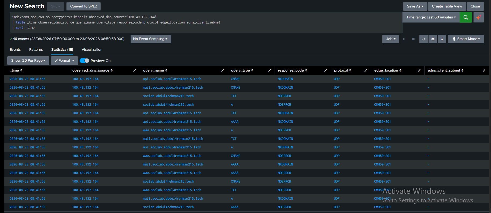

# E03 — Exact Activity Timeline

| **Time range**    | Last 60 minutes                                                      |
|-------------------|----------------------------------------------------------------------|
| **Evidence file** | Case-01_E03_Activity-Timeline.png                                    |
| **Purpose**       | Establish whether the activity was concentrated or spread over time. |

## Exact SPL

> index=dns_soc_aws sourcetype=aws:kinesis
> observed_dns_source="100.49.192.164"  
> | bin _time span=1s  
> | stats count as queries  
> dc(query_name) as unique_names  
> dc(query_type) as distinct_query_types  
> values(query_type) as query_types  
> values(query_name) as query_names  
> values(response_code) as response_codes  
> by _time  
> | sort _time

## What the evidence shows

- All 16 queries occurred at 2026-08-23 08:41:55 within the same
  one-second bucket.

- The burst contained 4 unique names and 4 record types.

## Evidence screenshot

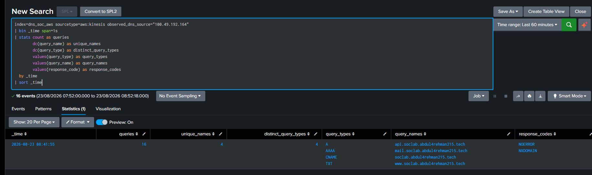

# E04 — Historical Baseline

| **Time range**    | Last 7 days                                                            |
|-------------------|------------------------------------------------------------------------|
| **Evidence file** | Case-01_E04_Historical-Baseline.png                                    |
| **Purpose**       | Determine whether the source had shown comparable DNS behavior before. |

## Exact SPL

> index=dns_soc_aws sourcetype=aws:kinesis
> observed_dns_source="100.49.192.164"  
> | bin _time span=1h  
> | stats count as query_count  
> dc(query_name) as unique_names  
> dc(query_type) as distinct_query_types  
> by _time  
> | sort _time

## What the evidence shows

- Only the current 16-query / 4-name / 4-type activity appeared in the
  available 7-day history.

## Evidence screenshot

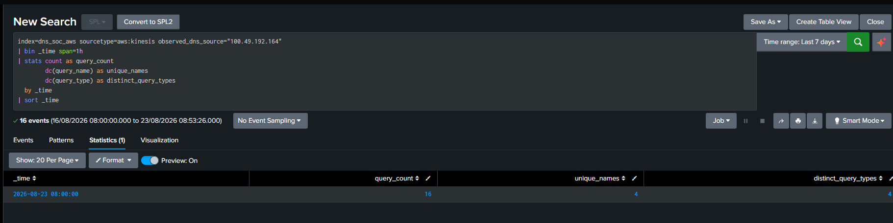

# E05 — Cross-Telemetry Presence

| **Time range**    | Last 7 days                                                            |
|-------------------|------------------------------------------------------------------------|
| **Evidence file** | Case-01_E05_Cross-Telemetry-Correlation.png                            |
| **Purpose**       | Check whether the source IP is visible in other indexed AWS telemetry. |

## Exact SPL

> index=dns_soc_aws "100.49.192.164"  
> | stats count  
> min(_time) as first_seen  
> max(_time) as last_seen  
> by sourcetype  
> | convert ctime(first_seen) ctime(last_seen)  
> | sort - count

## What the evidence shows

- The source appeared in aws:cloudtrail, aws:kinesis, and aws:s3
  telemetry.

- This provided a defender-side path for asset attribution.

## Evidence screenshot

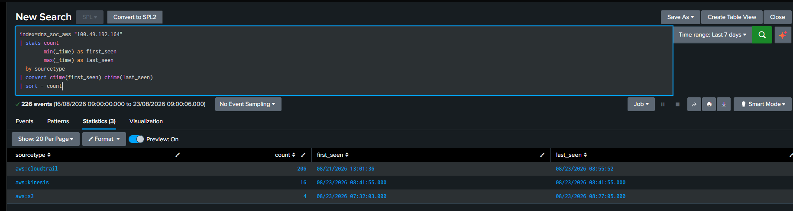

# E06 — CloudTrail / SSM Asset Attribution

| **Time range**    | Last 7 days                                                      |
|-------------------|------------------------------------------------------------------|
| **Evidence file** | Case-01_E06_CloudTrail-SSM-Asset-Attribution.png                 |
| **Purpose**       | Tie the public source IP to a managed AWS EC2 instance and role. |

## Exact SPL

> index=dns_soc_aws sourcetype=aws:cloudtrail "100.49.192.164"  
> | table _time eventName eventSource sourceIPAddress
> userIdentity.type userIdentity.arn userAgent awsRegion errorCode  
> | sort - _time

## What the evidence shows

- 100.49.192.164 was associated with successful SSM activity.

- CloudTrail showed an AssumedRole using DNS-SOC-EC2-SSM-Role and
  instance/session identifier i-077d7b9a9de0b1387.

## Evidence screenshot

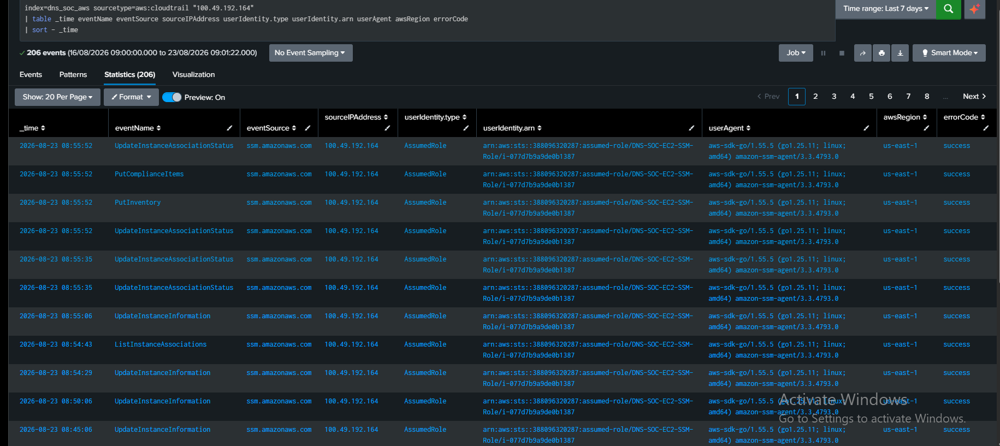

# E07 — Resolver / Private-IP Correlation

| **Time range**    | Last 7 days                                                                      |
|-------------------|----------------------------------------------------------------------------------|
| **Evidence file** | Case-01_E07_Resolver-Private-IP-Correlation.png                                  |
| **Purpose**       | Correlate the instance identifier with its private IP in defender DNS telemetry. |

## Exact SPL

> index=dns_soc_aws "i-077d7b9a9de0b1387"  
> ("Name" OR "tagSet" OR "tags" OR "dns-soc")  
> | table _time sourcetype eventName eventSource sourceIPAddress
> _raw  
> | sort - _time  
> | head 50

## What the evidence shows

- aws:s3 DNS records contained srcaddr 10.50.10.10 and srcids.instance
  i-077d7b9a9de0b1387.

- This correlated the public observed source to a known VPC asset
  identity.

## Evidence screenshot

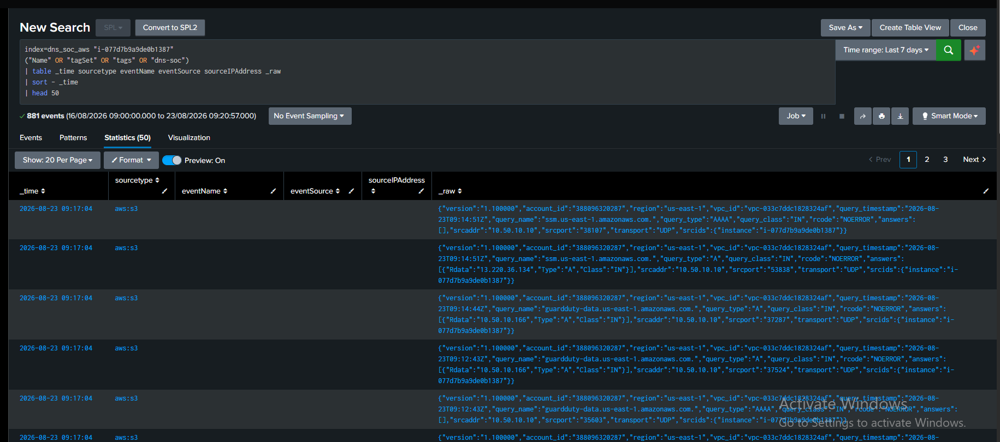

# E08 — AWS EC2 Asset Context

| **Time range**    | Point-in-time AWS console state                                              |
|-------------------|------------------------------------------------------------------------------|
| **Evidence file** | Case-01_E08_AWS-EC2-Asset-Context.png                                        |
| **Purpose**       | Confirm the instance name, network placement, and public/private addressing. |

## What the evidence shows

- Instance name: dns-soc-web01.

- Instance ID: i-077d7b9a9de0b1387.

- Public IPv4 / Elastic IP: 100.49.192.164.

- Private IPv4: 10.50.10.10.

- VPC: SOC-LAB-VPC; subnet: SOC-TARGET-SUBNET.

## Evidence screenshot

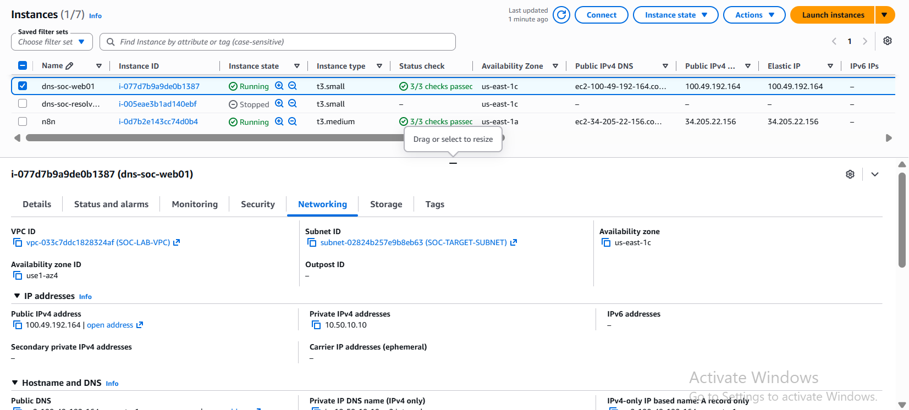

# E09 — AI-Generated Summary and Human Validation

| **Time range**    | Last 4 hours                                                                |
|-------------------|-----------------------------------------------------------------------------|
| **Evidence file** | Case-01_E09a_to_E09e_AI-Summary.png                                         |
| **Purpose**       | Preserve the structured AI enrichment and validate it against raw evidence. |

## Exact SPL

> index=dns_soc_ai "100.49.192.164"  
> | table _time alert.* ai.*  
> | sort - _time

## What the evidence shows

- AI identified possible DNS reconnaissance, mapped T1590.002 and
  Reconnaissance, and used medium confidence.

- AI correctly identified missing timing, ownership, authorization, and
  network-context evidence instead of asserting an attacker identity.

- Human investigation resolved timing, UDP transport, baseline, and
  asset identity.

## Evidence screenshot

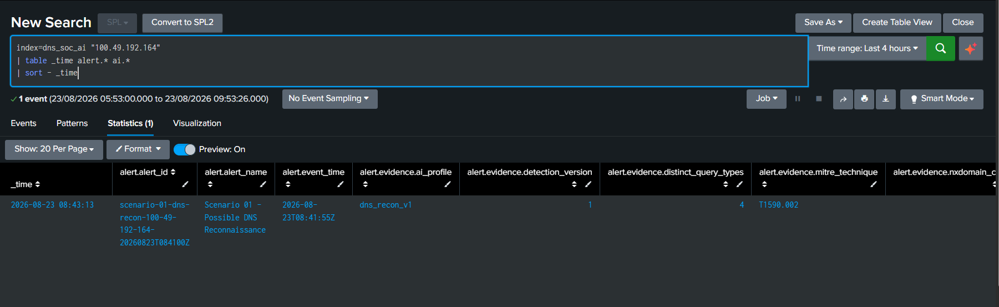

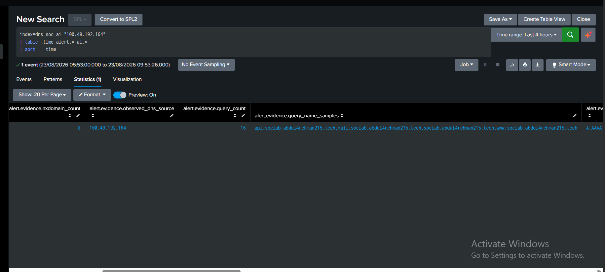

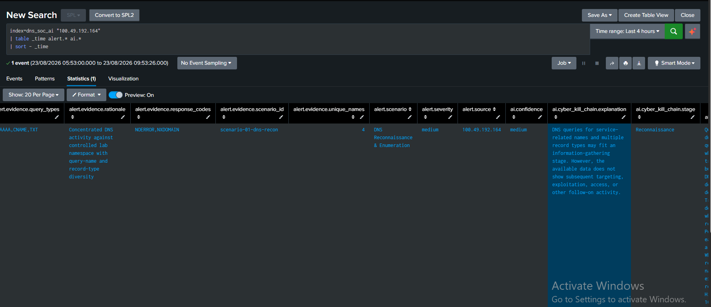

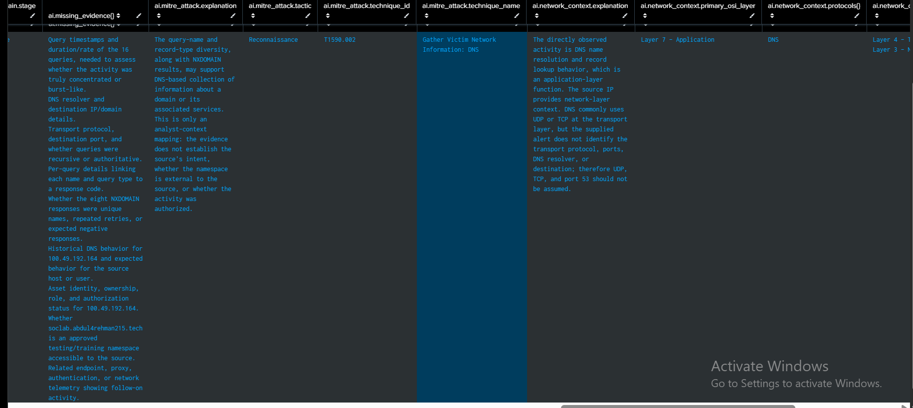

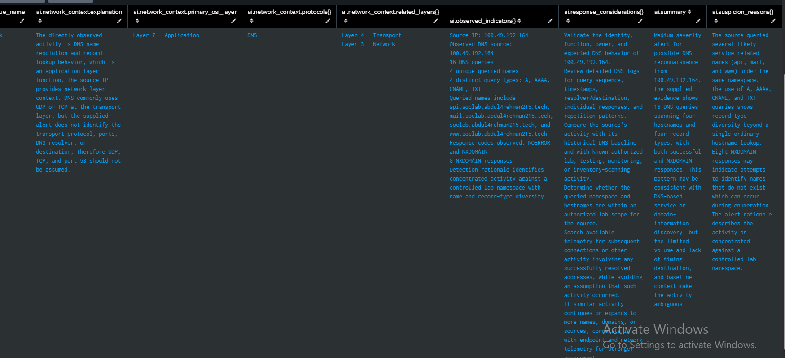

# E10 — Authorization Confirmation and Closure Decision

| **Time range**    | Investigation closeout                                                                                                |
|-------------------|-----------------------------------------------------------------------------------------------------------------------|
| **Evidence file** | Case-01_E10_Authorization-Confirmation.txt                                                                            |
| **Purpose**       | Record the authorization context required to distinguish an Authorized TP from an unknown or suspicious owned source. |

## What the evidence shows

- Manual lab-owner/environment confirmation established that the
  reconnaissance-like activity was approved in the controlled SOC lab.

- No separate change-ticket or authorization screenshot was supplied in
  this chat; add one if audit-grade external proof is required for
  publication.

