# Case 02 — SOC Investigation & IR Handoff

**Scenario 01 — DNS Reconnaissance & Enumeration**  
**SOC Analyst:** [Musfira](https://github.com/MUSFIRA-ZAFAR)  
**Date:** 2026-08-23  
**Production Detection:** v1.0 (frozen during execution)

[← SOC Workspace](README.md) · [SOC Investigation Story](SOC-ANALYST-INVESTIGATION.md) · [Incident Response](../ir/INCIDENT-RESPONSE.md)

> [!IMPORTANT]
> `54.242.155.119` is preserved as the **Route 53-observed DNS source / resolver**. The available authoritative DNS evidence does not by itself prove the original attacker endpoint.

| **Disposition** | **TRUE POSITIVE — Suspicious / Likely Unauthorized DNS Reconnaissance** |
|-----------------|-------------------------------------------------------------------------|
| **Confidence**  | High                                                                    |
| **Escalation**  | Escalated to Incident Response                                          |

# SOC Summary

The Scenario 01 production alert identified source 54.242.155.119
performing structured DNS reconnaissance against
soclab.abdul4rehman215.tech. Human analysis confirmed 53 queries across
17 unique names and six DNS record types, delivered in staged bursts
over approximately 43 seconds. Forty-four responses were NXDOMAIN
(83.02%). The source was first-seen in the available baseline and
appeared only in aws:kinesis within the dns_soc_aws index; no
defender-side ownership or approved-purpose correlation was established.
The evidence supports a high-confidence suspicious reconnaissance
disposition and escalation to Incident Response.

| **Observed source**  | 54.242.155.119                                     |
|----------------------|----------------------------------------------------|
| **Observed period**  | 2026-08-23 10:21:51 – 10:22:34                     |
| **Detection values** | 53 queries / 17 unique names / 6 query types       |
| **Query types**      | A, AAAA, MX, NS, SOA, TXT                          |
| **Response pattern** | 44 NXDOMAIN (83.02%) / 9 NOERROR (16.98%)          |
| **Target namespace** | soclab.abdul4rehman215.tech                        |
| **MITRE**            | T1590.002 — Gather Victim Network Information: DNS |
| **Kill Chain**       | Reconnaissance                                     |

# 5W1H Framework

| **Who**   | Observed DNS source 54.242.155.119. Available defender telemetry did not attribute it to a known owned asset, approved scanner, or authorized operational source.             |
|-----------|-------------------------------------------------------------------------------------------------------------------------------------------------------------------------------|
| **What**  | Structured DNS reconnaissance: 53 queries, 17 unique names, six record types, repeated service-name probing, and a high NXDOMAIN proportion.                                  |
| **When**  | 2026-08-23 10:21:51 to 10:22:34 (about 43 seconds).                                                                                                                           |
| **Where** | Public authoritative namespace soclab.abdul4rehman215.tech, observed in index=dns_soc_aws sourcetype=aws:kinesis.                                                             |
| **Why**   | DNS evidence cannot directly prove intent. The systematic first-seen enumeration pattern and lack of known authorization support a suspicious/likely unauthorized assessment. |
| **How**   | UDP DNS issued in staged bursts: multi-record interrogation of the base domain, broad A queries, broad TXT queries, then another broad A burst across service-oriented names. |

# Risk Assessment

Risk: Medium. Confidence in the SOC disposition: High. Successful
reconnaissance can expose valid hostnames, service naming conventions,
DNS/mail infrastructure, and candidate systems for later targeting. The
source was first-seen, the activity was structured and burst-like, and
no known ownership/authorization correlation was found. No evidence
currently establishes exploitation, persistence, command-and-control,
exfiltration, or impact, so the case remains scoped to Reconnaissance
unless IR discovers follow-on activity.

# AI vs Human Validation

- AI assessed possible DNS reconnaissance, T1590.002, and Reconnaissance
  with medium confidence.

- The AI event with query_count=53 and event time 10:21:51 matches the
  raw case evidence; use that enrichment as the case-correlated AI
  event.

- AI correctly stated that identity, authorization, timing/burst
  context, and follow-on activity were not established by the supplied
  alert payload.

- Human investigation resolved timing, UDP transport, query-name
  breadth, response pattern, and first-seen baseline.
  Ownership/authorization remained unresolved.

- AI did not provide evidence sufficient for automatic containment;
  containment remains an IR decision.

# Final Disposition / Confidence / Escalation

| **Disposition** | **TRUE POSITIVE — Suspicious / Likely Unauthorized DNS Reconnaissance** |
|-----------------|-------------------------------------------------------------------------|
| **Confidence**  | High                                                                    |
| **Escalation**  | Escalate to Incident Response                                           |

Escalation reason: systematic first-seen DNS enumeration against a
public namespace, high query-name breadth, six record types, staged
bursts, high NXDOMAIN rate, and no known authorization/ownership
correlation in the available defender telemetry.

# Evidence Register

| **ID** | **Evidence**                                | **Time Range**         | **File**                                            | **Status** |
|--------|---------------------------------------------|------------------------|-----------------------------------------------------|------------|
| E01    | Production Alert Source / Threshold Proof   | Last 4 hours           | Case-02_E01_Production-Detection-Triggered.png      | Final      |
| E02    | Raw DNS Events                              | Last 4 hours           | Case-02_E02_Raw-DNS-Events.png                      | Final      |
| E03    | Activity Timeline                           | Last 4 hours           | Case-02_E03_Activity-Timeline.png                   | Final      |
| E04    | Query-Name Breadth                          | Last 4 hours           | Case-02_E04_Query-Name-Breadth.png                  | Final      |
| E05    | Response-Code Pattern                       | Last 4 hours           | Case-02_E05_Response-Code-Pattern.png               | Final      |
| E06    | Historical Baseline                         | Last 7 days            | Case-02_E06_Historical-Baseline.png                 | Final      |
| E07    | Cross-Telemetry Correlation                 | Last 7 days            | Case-02_E07_Cross-Telemetry-Correlation.png         | Final      |
| E08    | AI-Generated Summary and Human Validation   | Last 7 days            | Case-02_E08a_to_E08e_AI-Summary.png                 | Final      |
| E09    | Source Ownership / Authorization Unresolved | Last 7 days            | Case-02_E09_Source-Ownership-Unresolved.png         | Final      |
| E10    | SOC Final Disposition and IR Escalation     | Investigation closeout | Case-02_E10_Final-Disposition-and-IR-Escalation.txt | Case note  |

# E01 — Production Alert Source / Threshold Proof

| **Time range**    | Last 4 hours                                                                        |
|-------------------|-------------------------------------------------------------------------------------|
| **Evidence file** | Case-02_E01_Production-Detection-Triggered.png                                      |
| **Purpose**       | Show that the alert source substantially exceeded the frozen production thresholds. |

## Exact SPL

> index=dns_soc_aws sourcetype=aws:kinesis
> observed_dns_source="54.242.155.119"  
> | stats count as query_count  
> dc(query_name) as unique_names  
> dc(query_type) as distinct_query_types  
> values(query_type) as query_types  
> values(response_code) as response_codes  
> min(_time) as first_seen  
> max(_time) as last_seen  
> | convert ctime(first_seen) ctime(last_seen)

## What the evidence shows

- 54.242.155.119 generated 53 queries, 17 unique names, and 6 record
  types.

- Record types: A, AAAA, MX, NS, SOA, TXT.

- Observed interval: 2026-08-23 10:21:51 to 10:22:34.

## Evidence screenshot

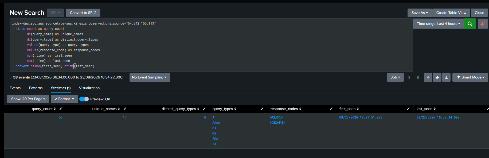

# E02 — Raw DNS Events

| **Time range**    | Last 4 hours                                      |
|-------------------|---------------------------------------------------|
| **Evidence file** | Case-02_E02_Raw-DNS-Events.png                    |
| **Purpose**       | Preserve event-level DNS evidence for the source. |

## Exact SPL

> index=dns_soc_aws sourcetype=aws:kinesis
> observed_dns_source="54.242.155.119"  
> | table _time observed_dns_source query_name query_type
> response_code protocol edge_location edns_client_subnet  
> | sort _time

## What the evidence shows

- The base domain was queried with SOA, MX, A, NS, AAAA, and TXT.

- Service-style labels such as test, staging, stage, api, prod, dev, db,
  app, vpn, backup and others were probed.

- Protocol was UDP; responses included NOERROR and NXDOMAIN.

## Evidence screenshot

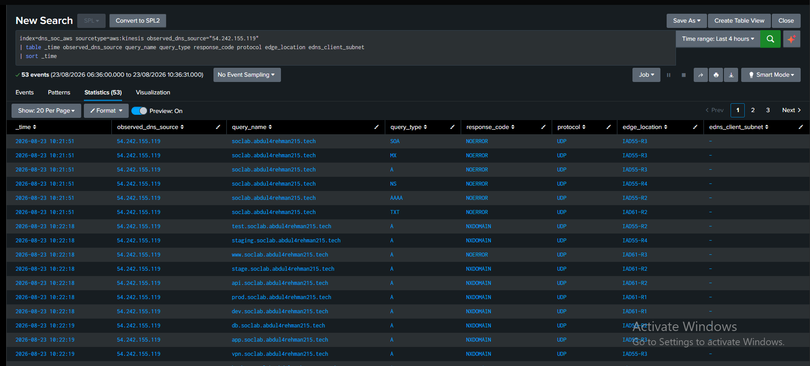

# E03 — Activity Timeline

| **Time range**    | Last 4 hours                                      |
|-------------------|---------------------------------------------------|
| **Evidence file** | Case-02_E03_Activity-Timeline.png                 |
| **Purpose**       | Show the staged burst pattern of the enumeration. |

## Exact SPL

> index=dns_soc_aws sourcetype=aws:kinesis
> observed_dns_source="54.242.155.119"  
> | bin _time span=10s  
> | stats count as queries  
> dc(query_name) as unique_names  
> dc(query_type) as distinct_query_types  
> values(query_type) as query_types  
> values(response_code) as response_codes  
> by _time  
> | sort _time

## What the evidence shows

- 10:21:50: 6 queries against one name using six record types.

- 10:22:10: 16 queries across 16 names using A.

- 10:22:20: 15 queries across 15 names using TXT.

- 10:22:30: 16 queries across 16 names using A.

## Evidence screenshot

# E04 — Query-Name Breadth

| **Time range**    | Last 4 hours                                                                 |
|-------------------|------------------------------------------------------------------------------|
| **Evidence file** | Case-02_E04_Query-Name-Breadth.png                                           |
| **Purpose**       | Document the breadth and service-oriented naming pattern of the enumeration. |

## Exact SPL

> index=dns_soc_aws sourcetype=aws:kinesis
> observed_dns_source="54.242.155.119"  
> | stats count as query_count  
> values(query_type) as query_types  
> values(response_code) as response_codes  
> by query_name  
> | sort - query_count

## What the evidence shows

- The source probed many meaningful service/environment labels including
  admin, api, backup, db, dev, internal, mail, monitor, portal, prod,
  stage, staging, test and vpn.

- Most guessed labels returned NXDOMAIN; the base domain returned
  NOERROR.

## Evidence screenshot

# E05 — Response-Code Pattern

| **Time range**    | Last 4 hours                                   |
|-------------------|------------------------------------------------|
| **Evidence file** | Case-02_E05_Response-Code-Pattern.png          |
| **Purpose**       | Quantify NXDOMAIN versus successful responses. |

## Exact SPL

> index=dns_soc_aws sourcetype=aws:kinesis
> observed_dns_source="54.242.155.119"  
> | stats count as responses by response_code  
> | eventstats sum(responses) as total  
> | eval percent=round((responses/total)\*100,2)  
> | sort - responses

## What the evidence shows

- NXDOMAIN: 44 responses (83.02%).

- NOERROR: 9 responses (16.98%).

- NXDOMAIN is supporting context, not standalone proof of maliciousness.

## Evidence screenshot

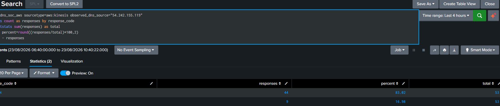

# E06 — Historical Baseline

| **Time range**    | Last 7 days                                                     |
|-------------------|-----------------------------------------------------------------|
| **Evidence file** | Case-02_E06_Historical-Baseline.png                             |
| **Purpose**       | Determine whether the source had comparable prior DNS behavior. |

## Exact SPL

> index=dns_soc_aws sourcetype=aws:kinesis
> observed_dns_source="54.242.155.119"  
> | bin _time span=1h  
> | stats count as query_count  
> dc(query_name) as unique_names  
> dc(query_type) as distinct_query_types  
> by _time  
> | sort _time

## What the evidence shows

- Analyst confirmed this was the only observed behavior for the source
  in the available 7-day history.

- Activity aggregated into a single 1-hour bucket at 2026-08-23
  10:00:00, with 17 unique queried names and 6 distinct query types.

- No other 1-hour window in the 7-day history showed comparable activity
  from this source, consistent with the earlier verbal confirmation.

## Evidence screenshot

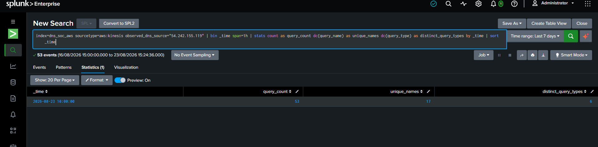

# E07 — Cross-Telemetry Correlation

| **Time range**    | Last 7 days                                                               |
|-------------------|---------------------------------------------------------------------------|
| **Evidence file** | Case-02_E07_Cross-Telemetry-Correlation.png                               |
| **Purpose**       | Check whether the source appears in any other indexed defender telemetry. |

## Exact SPL

> index=dns_soc_aws "54.242.155.119"  
> | stats count  
> min(_time) as first_seen  
> max(_time) as last_seen  
> by sourcetype  
> | convert ctime(first_seen) ctime(last_seen)  
> | sort - count

## What the evidence shows

- The source appeared only in aws:kinesis within the available
  dns_soc_aws telemetry.

- No defender-side CloudTrail/S3 ownership correlation was found in this
  index.

## Evidence screenshot

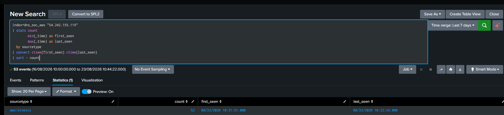

# E08 — AI-Generated Summary and Human Validation

| **Time range**    | Last 7 days                                                         |
|-------------------|---------------------------------------------------------------------|
| **Evidence file** | Case-02_E08a_to_E08e_AI-Summary.png                                 |
| **Purpose**       | Preserve the AI enrichment and compare it to raw defender evidence. |

## Exact SPL

> index=dns_soc_ai "54.242.155.119"  
> | table _time alert.\* ai.\*  
> | sort - _time

## What the evidence shows

- AI identified possible DNS reconnaissance, T1590.002, and
  Reconnaissance with medium confidence.

- The AI event with query_count=53 and event time 10:21:51 aligns with
  the raw case evidence.

- AI explicitly stated that source identity, authorization, timing/burst
  context, and follow-on activity were not established.

- Human analysis resolved timing, UDP protocol, and first-seen baseline;
  ownership/authorization remained unresolved.

## Evidence screenshot

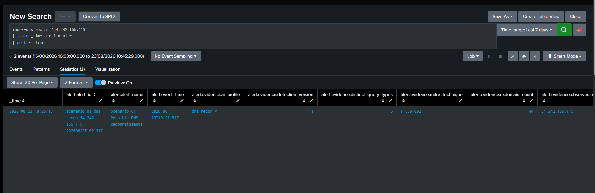

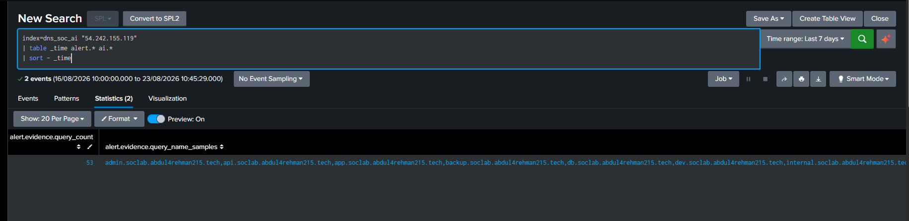

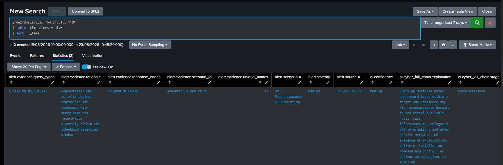

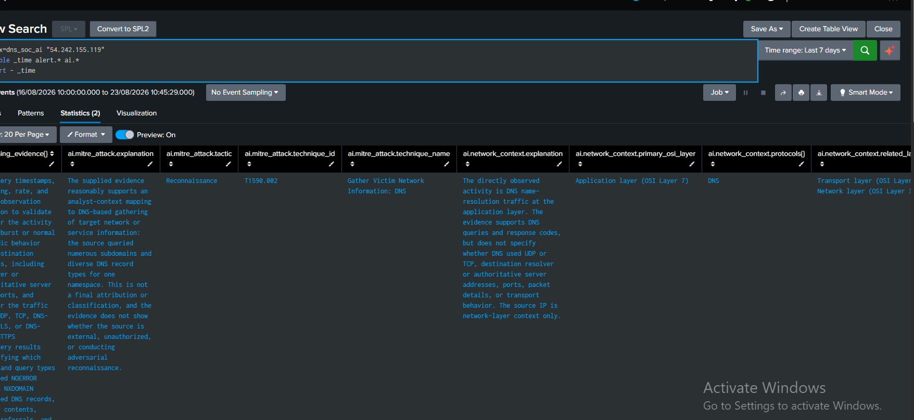

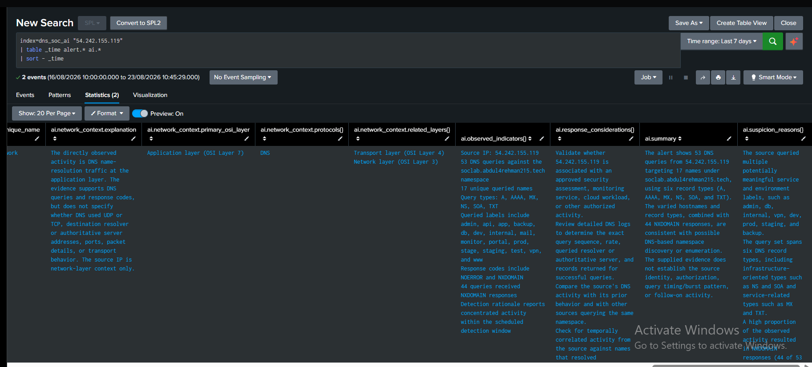

# E09 — Source Ownership / Authorization Unresolved

| **Time range**    | Last 7 days                                                            |
|-------------------|------------------------------------------------------------------------|
| **Evidence file** | Case-02_E09_Source-Ownership-Unresolved.png                            |
| **Purpose**       | Confirm whether the source has any additional indexed AWS association. |

## Exact SPL

> index=dns_soc_aws "54.242.155.119"  
> | stats count by sourcetype

## What the evidence shows

- All 53 matching events were aws:kinesis.

- No additional indexed AWS telemetry established ownership or an
  approved purpose.

## Evidence screenshot

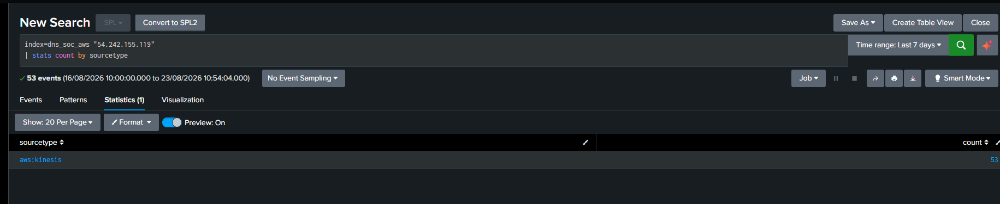

# E10 — SOC Final Disposition and IR Escalation

| **Time range**    | Investigation closeout                                                  |
|-------------------|-------------------------------------------------------------------------|
| **Evidence file** | Case-02_E10_Final-Disposition-and-IR-Escalation.txt                     |
| **Purpose**       | Record the SOC decision and transfer of ownership to Incident Response. |

## What the evidence shows

- Disposition: TRUE POSITIVE — Suspicious / Likely Unauthorized DNS
  Reconnaissance.

- SOC confidence: High.

- IR escalation justified due to structured first-seen reconnaissance
  with no known authorization/ownership correlation.

# IR Handoff

Handoff summary: Route 53-observed DNS source 54.242.155.119 generated 53 DNS queries against
soclab.abdul4rehman215.tech from 10:21:51 to 10:22:34, covering 17
unique names and six DNS record types. Activity occurred in staged
bursts and produced 44 NXDOMAIN responses. The source was first-seen in
the available baseline and no known ownership or authorization
correlation was found in the available defender telemetry. SOC assesses
the activity as a high-confidence True Positive for suspicious/likely
unauthorized DNS reconnaissance and escalates for follow-on correlation,
containment decision, and response.
